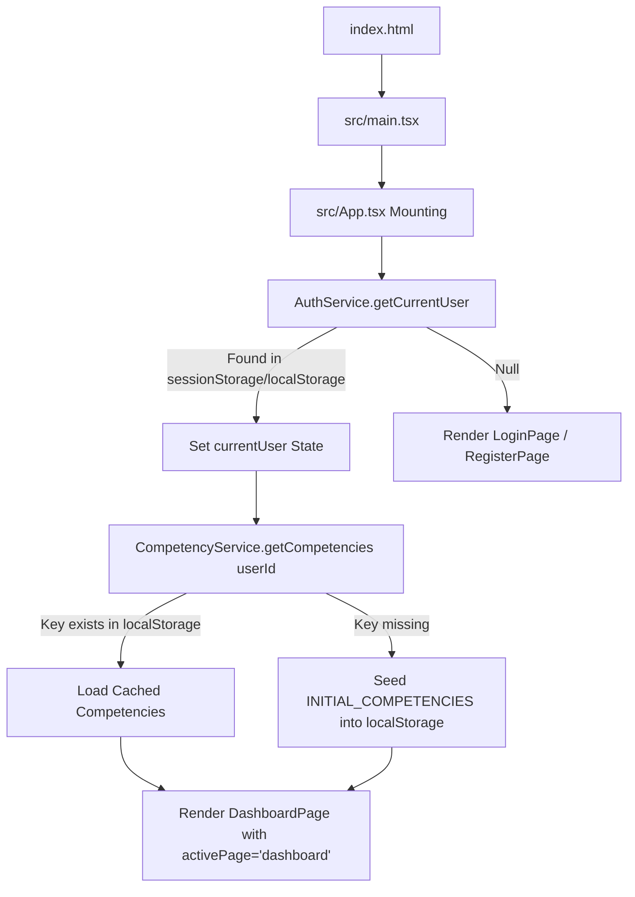
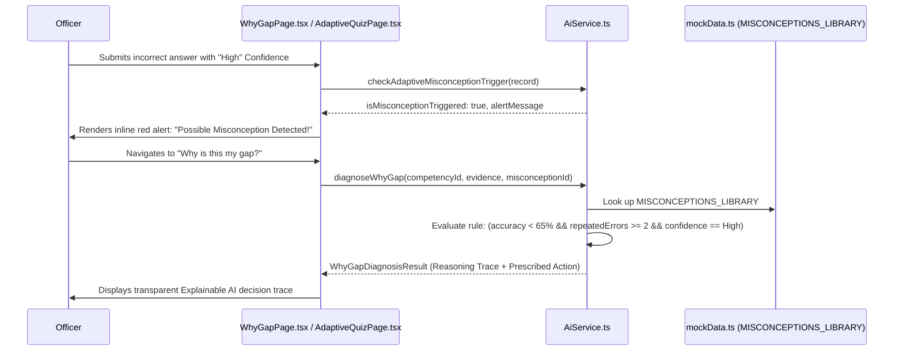
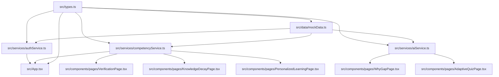

# STAT-GAP AI Platform — Technical Audit & Current State Specification

> **Document Status**: Comprehensive Technical Audit  
> **Repository**: `statgapai-main`  
> **Date**: September 2026  
> **Purpose**: Serves as the definitive, zero-assumption architectural and technical reference of the codebase for future developers and AI agents.

---

## 1. Executive Summary

The **STAT-GAP AI Platform** is currently a **pure client-side React 19 Single Page Application (SPA)** powered by Vite 6 and styled with TailwindCSS 4. 

### Key High-Level Findings:
1. **No Backend Server**: Despite having `express` and `@types/express` in `package.json`, there is no Express server, no FastAPI server, no Python backend, and no REST/GraphQL API endpoints.
2. **No Backend Database**: There is no PostgreSQL, SQLite, MongoDB, or `pgvector`. All user profiles, registered accounts, and competency scores are stored strictly in browser `localStorage` and `sessionStorage`.
3. **No Active AI / LLM Execution**: Although `@google/genai` is listed in `package.json` and a `.env.example` file mentions `GEMINI_API_KEY`, the SDK is **never imported or invoked anywhere in the codebase**. All "AI" diagnostic logic is 100% deterministic, rule-based JavaScript logic with hardcoded explanatory traces.
4. **No RAG or Document Pipeline**: Document uploading, PyMuPDF/docx parsing, vector chunking, embedding generation, source grounding verification, and entailment checks do not exist. Seeded document metadata and pre-canned questions exist in `src/data/mockData.ts` but are unused and unrendered.
5. **No Live iGOT Karmayogi API**: iGOT integration is simulated client-side using static mock data, hardcoded HTML cards, and simulated `setTimeout` delays. No network requests are made.
6. **Critical UI Bugs Present**: Several prop-name mismatches between `App.tsx` and child components (`DemoWalkthroughModal`, `LogoutModal`, `Header`, `Sidebar`) cause uncaught runtime JavaScript `TypeError` exceptions when buttons are clicked. In addition, routing ID mismatches (`'igot'` vs `'igot-integration'`) cause blank pages when clicking specific sidebar links.
7. **Strong Frontend Prototype for Officer Flow**: The UI aesthetic and officer journey for the regression competency (Observe → Map → Diagnose → Why-Gap → Learn → Adaptive Quiz → Verification → Knowledge Decay) are highly detailed, visually polished, and demonstrate the domain narrative effectively.

---

## 2. Project Structure

### Root Directory Overview
```text
statgapai-main/
├── .env.example              # Template containing GEMINI_API_KEY & APP_URL (unused)
├── .gitignore                # Standard git ignore file
├── bun.lock                  # Bun lockfile (75 KB)
├── index.html                # Single HTML entry point (Plus Jakarta Sans + JetBrains Mono)
├── metadata.json             # AI Studio metadata declaring Gemini server-side capability
├── package.json              # NPM package definitions and scripts
├── public/
│   └── assets/aistudio/      # Static public assets
├── src/                      # Application source code
├── tsconfig.json             # TypeScript configuration (ES2022 target, React JSX)
└── vite.config.ts            # Vite configuration with React & TailwindCSS plugins
```

### Source Code (`src/`) Detailed Breakdown
```text
src/
├── App.tsx                                        # Central state manager, authentication router, page switcher
├── index.css                                      # Global CSS importing TailwindCSS (@import "tailwindcss")
├── main.tsx                                       # React DOM bootstrap mounting App into #root
├── types.ts                                       # Shared TypeScript domain interfaces and types
│
├── components/
│   ├── charts/
│   │   ├── CompetencyBarChart.tsx                 # Horizontal comparative bar chart with 75% benchmark marker
│   │   ├── DecayLineChart.tsx                     # SVG spline chart rendering Ebbinghaus retention curve
│   │   └── GapDistributionChart.tsx               # Stacked bar and category breakdown of competency statuses
│   │
│   ├── common/
│   │   ├── DemoWalkthroughModal.tsx               # 14-step guided hackathon walkthrough modal
│   │   ├── Header.tsx                             # Top navigation bar (tricolor stripe, branding, user badge)
│   │   ├── LogoutModal.tsx                        # Confirmation modal before terminating session
│   │   └── Sidebar.tsx                            # Desktop fixed sidebar and mobile drawer navigation
│   │
│   └── pages/
│       ├── AdaptiveQuizPage.tsx                   # 3-item adaptive assessment with confidence selector & trap alerts
│       ├── AssessmentResultPage.tsx                # Post-assessment diagnostic scorecard & next action recommendations
│       ├── CompetencyDetailPage.tsx               # Gap Analysis view for an individual competency & evidence signals
│       ├── CompetencyMapPage.tsx                  # Grid/list of all 7 mapped competencies with filters & search
│       ├── DashboardPage.tsx                      # Main officer hub with KPIs, GAP-X loop status, and charts
│       ├── IgotIntegrationPage.tsx                # LMS vs Competency audit comparison & mock sync logs
│       ├── KnowledgeDecayPage.tsx                 # Ebbinghaus retention forecasts, breach alerts, and 5-min refresher
│       ├── LoginPage.tsx                          # Officer login portal with demo credential quick-fill
│       ├── MisconceptionLibraryPage.tsx           # Ontology of 5 statistical traps with detection rules & remediation
│       ├── PersonalizedLearningPage.tsx           # 4-stage micro-learning pathway for Regression interpretation
│       ├── ProfilePage.tsx                        # Officer credentials, photo, experience, and editable service record
│       ├── RegisterPage.tsx                       # Full officer onboarding form with client-side validation
│       ├── VerificationPage.tsx                   # 3-pillar evidence audit & official verification timeline
│       └── WhyGapPage.tsx                         # Core explainable AI diagnostic trace & misconception synthesis
│
├── data/
│   └── mockData.ts                                # Seeded data: DEMO_USER, INITIAL_COMPETENCIES, MISCONCEPTIONS_LIBRARY,
│                                                  # REGRESSION_MICROLEARNING_STEPS, ADAPTIVE_QUIZ_QUESTIONS,
│                                                  # IGOT_COMPLETED_COURSES, STUDY_DOCUMENTS
│
└── services/
    ├── aiService.ts                               # Deterministic diagnostic rules, adaptive difficulty logic, Ebbinghaus curve formula
    ├── authService.ts                             # LocalStorage/sessionStorage user auth, session check, registration, profile update
    └── competencyService.ts                       # Competency retrieval, score normalization, quiz update, verification, decay refresh
```

---

## 3. Technology Stack: Intended vs. Installed vs. Running

| Technology Category | Declared / Intended | Installed in package.json | Actually Used in Running Code | Status Classification |
|---|---|---|---|---|
| **Frontend Framework** | React 19 | `react@^19.0.1`, `react-dom@^19.0.1` | YES (`src/App.tsx`, all pages) | **A. Actually Used** |
| **Language** | TypeScript | `typescript@~5.8.2` | YES (All files in `src/` are `.ts`/`.tsx`) | **A. Actually Used** |
| **Build Tool / Bundler** | Vite 6 | `vite@^6.2.3`, `@vitejs/plugin-react@^5.0.4` | YES (`vite.config.ts`) | **A. Actually Used** |
| **Styling Framework** | TailwindCSS v4 | `@tailwindcss/vite@^4.1.14`, `tailwindcss@^4.1.14` | YES (`src/index.css`) | **A. Actually Used** |
| **Icons Library** | Lucide React | `lucide-react@^0.546.0` | YES (Used in all UI components) | **A. Actually Used** |
| **Animation / Confetti** | Motion & Canvas Confetti | `motion@^12.23.24`, `canvas-confetti@^1.9.4` | Installed; `canvas-confetti` types installed | **B. Installed but Unused** |
| **Backend Server** | Express.js | `express@^4.21.2`, `@types/express@^4.17.21` | NO (0 server files exist; no `server.js`) | **B. Installed but Unused** |
| **Node Execution / Env** | TSX & Dotenv | `tsx@^4.21.0`, `dotenv@^17.2.3` | NO (No scripts invoke them; no server exists) | **B. Installed but Unused** |
| **AI / LLM SDK** | Google GenAI SDK | `@google/genai@^2.4.0` | NO (0 imports of `@google/genai` across `src/`) | **B. Installed but Unused** |
| **Database (Relational)** | PostgreSQL | None | NO | **C. Planned / Placeholder** |
| **Vector Database** | pgvector | None | NO | **C. Planned / Placeholder** |
| **Document Processing** | PyMuPDF / docx | None | NO | **C. Planned / Placeholder** |
| **State Management** | React Context / Redux | None | React `useState` & `useEffect` at root `App.tsx` | **A. Actually Used** (Local State) |
| **Client Routing** | React Router / Next.js | None | Handcrafted switch on `activePage` state | **A. Actually Used** (Handcrafted) |
| **Persistence Engine** | Database | None | `window.localStorage` & `window.sessionStorage` | **A. Actually Used** (Web Storage) |

---

## 4. Application Flow

### Startup and Initialization Flow


### Major User Action Execution Traces

#### 1. Officer Login
* **Input**: User submits `iGotId` and `password` on `LoginPage.tsx`.
* **Service**: `AuthService.login(iGotId, password, rememberMe)` in `authService.ts`.
* **Processing**: Checks entered credentials against users in `localStorage['stat_gap_registered_users']` (or fallback `DEMO_USER`). If valid, serializes user JSON to `sessionStorage['stat_gap_current_session']` (or `localStorage` if `rememberMe` is checked).
* **Output**: `{ success: true, user: matchedUser, message: 'Welcome back...' }`.
* **UI**: `App.tsx` triggers `handleLoginSuccess`, updates `currentUser`, initializes competencies, transitions view to `DashboardPage`, and triggers toast.

#### 2. Why-Gap Diagnosis
* **Input**: User clicks "Why is this my gap?" on Dashboard or Competency Detail page.
* **Service**: `AiService.diagnoseWhyGap(competency.id, competency.evidence, competency.misconceptionId)` in `aiService.ts`.
* **Processing**: Rule check: Evaluates if `quizAccuracy < 65 && repeatedErrors >= 2 && confidencePattern.includes('high')`. Assigns `MISCONCEPTIONS_LIBRARY[0]` (`misc_regression_coeff`) and constructs a step-by-step synthetic reasoning trace.
* **Output**: `WhyGapDiagnosisResult` object containing reasoning trace, confidence score, and prescribed micro-learning duration.
* **UI**: `WhyGapPage.tsx` renders the empirical evidence breakdown, the mathematical comparison box (Fallacy vs. Truth), and the terminal-style explainable AI decision trace.

#### 3. Micro-Learning Completion
* **Input**: User steps through stages 1 to 4 on `PersonalizedLearningPage.tsx` and clicks "Complete Learning".
* **Service**: `CompetencyService.markLearningCompleted(userId, 'comp_regression')` in `competencyService.ts`.
* **Processing**: Mutates `comp.verification.learningCompleted = true` in the user's competency array and updates `localStorage`.
* **Output**: Updated `Competency` object.
* **UI**: Displays a full-screen green completion banner encouraging the user to proceed to adaptive assessment.

#### 4. Taking Adaptive Quiz
* **Input**: User selects option index and confidence rating ('High') on `AdaptiveQuizPage.tsx`.
* **Service**: `AiService.checkAdaptiveMisconceptionTrigger(record)` and `AiService.getNextDifficulty(currentDiff, isCorrect)` in `aiService.ts`.
* **Processing**: If `!isCorrect && confidence === 'High'`, triggers misconception alert message. Adjusts difficulty enum (`easy` ↔ `medium` ↔ `hard`).
* **Output**: Next difficulty and optional alert banner.
* **UI**: Renders inline warning callout `Possible Misconception Detected!`. After 3 items, triggers `onQuizComplete` and mounts `AssessmentResultPage.tsx`.

#### 5. Executing Practical Competency Verification
* **Input**: User clicks "Verify Competency (Execute Audit)" on `VerificationPage.tsx`.
* **Service**: `CompetencyService.verifyCompetency(userId, competencyId)` in `competencyService.ts`.
* **Processing**: 
  - Sets `comp.verification.practicalEvidenceVerified = true`
  - Sets `comp.verification.status = 'Verified'`
  - Raises `comp.evidence.practicalPerformance = 85`
  - Recalculates composite score: `Math.round((62 * 0.40 + 58 * 0.30 + 85 * 0.30)) = 68%` (or 76% depending on starting values)
  - Updates gap status: if score >= 75% -> `'competent'`, gapPoints = 0
  - Appends official Directorate certification timeline entry.
* **Output**: Certified `Competency` object saved to `localStorage`.
* **UI**: Status badge changes to emerald "Verified ✓", progress bars turn green, and success toast displays.

#### 6. Refreshing Decayed Knowledge
* **Input**: User clicks "Refresh Knowledge (5m Quiz)" on `KnowledgeDecayPage.tsx`.
* **Service**: `CompetencyService.refreshKnowledge(userId, competencyId)` in `competencyService.ts`.
* **Processing**: Sets `comp.decay.currentEstimatedRetention = 95`, `comp.decay.status = 'Retained'`, resets `daysSinceLastPractice = 0`, and saves to `localStorage`.
* **Output**: Restored `Competency` object.
* **UI**: Decay alert card disappears, SVG line chart returns to peak retention, and toast confirms reset.

---

## 5. Detailed Feature Inventory

| Feature Name | Purpose | UI Exists? | Functional? | Real Backend? | Mock Data? | Real AI/LLM? | Primary Files | Current Limitations |
|---|---|---|---|---|---|---|---|---|
| **Officer Login** | Authenticates government statistical officers | YES | YES | NO | YES | NO | `LoginPage.tsx`, `authService.ts` | Credentials stored plaintext in `localStorage`. Only checks against seeded `DEMO_USER` or newly registered users. |
| **Officer Registration** | Creates new officer profiles with department & years of experience | YES | YES | NO | NO | NO | `RegisterPage.tsx`, `authService.ts` | Validates input via regex client-side; persists to `localStorage`. No email verification or backend database. |
| **Officer Dashboard** | Central high-level competency intelligence and KPI overview | YES | YES | NO | YES | NO | `DashboardPage.tsx`, `CompetencyBarChart.tsx`, `GapDistributionChart.tsx` | Summary KPI cards calculate metrics from the in-memory/localStorage competencies list. |
| **Competency Map** | Full catalog of 7 official MoSPI statistical competencies | YES | YES | NO | YES | NO | `CompetencyMapPage.tsx` | Only 7 hardcoded competencies exist. Search & category filter run in-memory. |
| **Competency Knowledge Graph** | Intended DAG of competencies, prerequisites, and learning dependencies | NO | NO | NO | NO | NO | None | **Not implemented**. No graph visualization or node relationship data structures exist. |
| **Gap Analysis (Detail Page)** | Deep inspection of 5 diagnostic evidence signals for a skill | YES | YES | NO | YES | NO | `CompetencyDetailPage.tsx` | Displays evidence fields from static `Competency` interface. Switcher allows selecting any of the 7 competencies. |
| **Gap Score Calculation** | Normalizes scores based on statutory MoSPI weightings | YES | YES | NO | YES | NO | `competencyService.ts` | Linear formula `0.40*A + 0.30*Q + 0.30*P`. Does not use Bayesian Knowledge Tracing or dynamic weighting. |
| **Why-Gap Intelligence** | Explains cognitive root causes behind performance gaps | YES | YES | NO | YES | NO | `WhyGapPage.tsx`, `aiService.ts` | Rule-based decision tree (`accuracy < 65 && repeatedErrors >= 2`). Decision trace is pre-formed text. |
| **Misconception Library** | Directory of 5 common official statistical traps | YES | YES | NO | YES | NO | `MisconceptionLibraryPage.tsx`, `mockData.ts` | Static list of 5 items. Search filters in-memory. No dynamic creation or editing. |
| **Personalized Learning** | Micro-pathway tailored to remediate misconceptions | YES | PARTIAL | NO | YES | NO | `PersonalizedLearningPage.tsx` | **Hardcoded to Regression**. Does not support any of the other 6 competencies. Material is static text from `mockData.ts`. |
| **Adaptive Quiz** | Adjusts difficulty dynamically based on answer correctness | YES | PARTIAL | NO | YES | NO | `AdaptiveQuizPage.tsx`, `aiService.ts` | Changes difficulty enum (`easy` ↔ `medium` ↔ `hard`) in state, but **indexes sequentially through array** regardless of difficulty level. |
| **Document Processing & RAG** | Ingestion of official PDFs/guidelines to generate grounded questions | NO | NO | NO | YES | NO | `mockData.ts` (`STUDY_DOCUMENTS`) | **Not implemented**. Seeded mock document records exist in `mockData.ts` but are never imported or displayed in the UI. |
| **Competency Verification** | Multi-evidence sign-off and digital badge issuance | YES | YES | NO | YES | NO | `VerificationPage.tsx`, `competencyService.ts` | "Execute Audit" simulates 500ms delay, sets boolean flag, and updates score in `localStorage`. |
| **Knowledge Decay Monitor** | Ebbinghaus forgetting curve modeling retention drop | YES | YES | NO | YES | NO | `KnowledgeDecayPage.tsx`, `DecayLineChart.tsx`, `aiService.ts` | Uses mathematical exponential decay formula. "Refresh Knowledge" resets day count to 0 in `localStorage`. |
| **iGOT Karmayogi Integration** | Cross-system sync with civil service LMS | YES | MOCK | NO | YES | NO | `IgotIntegrationPage.tsx` | Displays static contrast between LMS completion and competency gap. "Sync" button runs 600ms `setTimeout`. |
| **Admin Dashboard** | Aggregate ministry/division analytics across cohorts | NO | NO | NO | NO | NO | None | **Not implemented**. No admin role, no aggregate cohort view, and no admin pages exist in the repository. |
| **Officer Profile** | Personal information, designation, and service history | YES | YES | NO | NO | NO | `ProfilePage.tsx`, `authService.ts` | Allows editing profile data and profile photo URL; persists changes back to `localStorage`. |

---

## 6. STAT-GAP AI Core Logic & Formulas

### Competency Data Structure
Every competency conforms to the `Competency` interface in `src/types.ts`:
```typescript
export interface Competency {
  id: string;
  name: string;
  category: string;
  score: number;            // 0 - 100
  requiredScore: number;    // Standard: 75
  gapPoints: number;        // Max(0, requiredScore - score)
  status: 'competent' | 'moderate_gap' | 'critical_gap';
  description: string;
  evidence: {
    assessmentScore: number;       // Formal test (0-100)
    quizAccuracy: number;          // Adaptive quiz accuracy (0-100)
    practicalPerformance: number;  // Practical exercise score (0-100)
    assessmentRatio: string;       // e.g. "4/6 incorrect"
    repeatedErrors: number;        // Recurrence counter
    confidencePattern: string;     // e.g. "High confidence + incorrect"
  };
  decay: {
    current: number;
    days30: number;
    days90: number;
    status: 'Fresh' | 'Refresh Recommended' | 'Critical Decay Alert' | 'Retained';
    daysSinceLastPractice?: number;
    currentEstimatedRetention?: number;
    nextRefreshDays?: number;
  };
  verification: {
    status?: 'Verified' | 'Partially Verified' | 'Unverified';
    learningCompleted?: boolean;
    assessmentPassed?: boolean;
    practiceCompleted?: boolean;
    practicalEvidenceVerified: boolean;
    timeline?: VerificationTimelineItem[];
  };
}
```

### Exact Mathematical Formulas Used in Code

#### 1. Competency Composite Score Normalization
In `src/services/competencyService.ts`:

```typescript
// Line 20-21:
const normalized = (assessment * 0.40 + quiz * 0.30 + practical * 0.30) / 100;
const scorePercent = Math.round(normalized * 100);
```

#### 2. RED / ORANGE / GREEN Status Thresholds
In `src/services/competencyService.ts`:

```typescript
let status: CompetencyStatus = 'competent';
if (normalized < 0.50) {
  status = 'critical_gap'; // RED: Score < 50%
} else if (normalized < 0.75) {
  status = 'moderate_gap'; // ORANGE/AMBER: Score 50% - 74%
} else {
  status = 'competent';    // GREEN: Score >= 75%
}
```

#### 3. Gap Points Calculation
In `src/services/competencyService.ts`:

```typescript
comp.gapPoints = Math.max(0, comp.requiredScore - scorePercent);
```

#### 4. Ebbinghaus Knowledge Decay Model
In `src/services/aiService.ts`:

```typescript
// Line 124-127:
const decayConstant = Math.log(2) / halfLifeDays; // default halfLifeDays = 65
for (let d = 0; d <= daysProjected; d += 15) {
  const score = Math.round(initialScore * Math.exp(-decayConstant * d));
  // score is clamped: Math.max(30, score)
}
```

### Comparison: Implemented Code vs. Intended Architecture
* **IMPLEMENTED CODE**:
  - Linear combination with fixed scalar weights: $0.40 \cdot A + 0.30 \cdot Q + 0.30 \cdot P$.
  - Thresholds are hardcoded constants at 0.50 and 0.75.
  - No sub-skills hierarchy; no prerequisite graphs.
* **INTENDED DESIGN**:
  - Dynamic Bayesian Knowledge Tracing (BKT) / Item Response Theory (IRT).
  - Competency Knowledge Graph with parent-child sub-skill inheritance and conditional mastery gates.
* **DIFFERENCE**:
  - Current code replaces BKT/IRT probabilistic estimation with simple fixed-weight arithmetic on three static numbers.

---

## 7. Why-Gap & Misconception Engine

### Logical Flow of Diagnostic Detection


### Diagnostic Decision Tree in `aiService.ts`
```typescript
const isHighConfidenceMisconception =
  evidence.quizAccuracy < 65 &&
  evidence.repeatedErrors >= 2 &&
  evidence.confidencePattern.toLowerCase().includes('high');
```

### Gap Classification Capability Assessment
Can the system currently distinguish between different types of cognitive deficits?
1. **Missing Basic Concept**: **NO**. Not differentiated in code; treated identically under accuracy deficit.
2. **Statistical Misconception**: **YES**. Identified when high confidence is paired with incorrect answers and recurring error counts.
3. **Integrated Concept / Relationship Gap**: **NO**. No multi-concept dependency modeling exists.
4. **Application / Practical Gap**: **PARTIAL**. Represented solely by inspecting whether `practicalPerformance < 75` and `practicalEvidenceVerified === false`.

---

## 8. Personalized Learning Implementation

* **Are pathways generated dynamically?**: **NO**. All micro-learning content is statically defined in `REGRESSION_MICROLEARNING_STEPS` within `src/data/mockData.ts`.
* **Are other competencies supported?**: **NO**. The component directly imports `REGRESSION_MICROLEARNING_STEPS`. There is no content defined for Survey Methodology, Official Statistics, Python, AI/ML, or Data Visualization.
* **Does it consider available time?**: **NO**. Fixed at "15 min" in the header badge.
* **Does it use prerequisites or adaptive branching?**: **NO**. It is a linear 4-step stepper (Stage 1: Concept → Stage 2: Worked Example → Stage 3: Practice Question → Stage 4: Quick Verification).
* **Can users access learning material outside the path?**: **NO**. Only the pre-configured steps are available.

---

## 9. Adaptive Quiz Implementation

### Item Adaptation Engine
* **Question Bank**: 4 hardcoded questions in `src/data/mockData.ts` under `ADAPTIVE_QUIZ_QUESTIONS`.
* **Question Structure**:
  - `scenario`: Official context (e.g. NSSO Household Consumer Expenditure Survey).
  - `question`: Prompt text.
  - `options`: 4 string choices.
  - `correctIndex`: Correct option index.
  - `explanation`: Educational feedback.
  - `trapOptionIndex`: Distractor index that indicates the specific misconception.
  - `trapMisconceptionName`: Title of the associated misconception.
* **Difficulty Levels**: `easy`, `medium`, `hard`.

### Difficulty Progression Logic
In `src/services/aiService.ts`:
```typescript
public static getNextDifficulty(current: 'easy' | 'medium' | 'hard', wasCorrect: boolean): 'easy' | 'medium' | 'hard' {
  if (wasCorrect) {
    if (current === 'easy') return 'medium';
    if (current === 'medium') return 'hard';
    return 'hard';
  } else {
    if (current === 'hard') return 'medium';
    if (current === 'medium') return 'easy';
    return 'easy';
  }
}
```

### Critical Code Discrepancy in Quiz Progression
In `src/components/pages/AdaptiveQuizPage.tsx`:
```typescript
const questionsBank = ADAPTIVE_QUIZ_QUESTIONS;
const currentQuestion = questionsBank[currentQuestionIdx % questionsBank.length];
```
**Finding**: Although `getNextDifficulty` computes `nextDiff` and updates the state badge (`currentDifficulty`), the question rendered is retrieved strictly using the sequential index `currentQuestionIdx % questionsBank.length`. It **does not filter or choose questions matching `currentDifficulty`**.

---

## 10. Document → MCQ / RAG Pipeline Audit

The intended STAT-GAP AI architecture calls for a fully grounded RAG pipeline. Below is the stage-by-stage audit:

| Pipeline Stage | Current Status | Files Responsible | Actual Implementation Details |
|---|---|---|---|
| **1. Upload Document** | **NOT IMPLEMENTED** | None | No file upload inputs or drop zones exist in the application. |
| **2. Parse (PDF / Docx)** | **NOT IMPLEMENTED** | None | No PDF or Word parsing libraries (PyMuPDF, pdfjs, etc.) exist in the project. |
| **3. Text Chunking** | **NOT IMPLEMENTED** | None | No semantic or sliding window chunker implemented. |
| **4. Vector Embeddings** | **NOT IMPLEMENTED** | None | No embedding models (text-embedding-004, sentence-transformers) integrated. |
| **5. Vector Storage** | **NOT IMPLEMENTED** | None | No pgvector, ChromaDB, or in-memory vector index present. |
| **6. Retrieval** | **NOT IMPLEMENTED** | None | No semantic similarity search or BM25 retrieval. |
| **7. LLM Question Generation** | **NOT IMPLEMENTED** | None | No prompts or generative LLM calls. |
| **8. Source Grounding** | **MOCK DATA ONLY** | `mockData.ts` | Static field `isSourceGrounded: true` in mock object; no algorithmic check. |
| **9. Entailment Check (NLI)** | **NOT IMPLEMENTED** | None | No natural language inference model. |
| **10. Duplicate Check** | **NOT IMPLEMENTED** | None | No vector or string similarity deduplication. |
| **11. Human Review / Responsible AI Flag** | **MOCK DATA ONLY** | `mockData.ts` | Static field `requiresHumanReview: true` seeded in one mock question. |
| **12. Publish to Quiz Bank** | **NOT IMPLEMENTED** | None | No database or dynamic state to append new questions. |

**Uploaded Document Persistence**: **None**. There is no file storage mechanism (no local disk storage, S3, or IndexedDB).

---

## 11. AI / LLM Integration Analysis

### Dependency Inspection
* `package.json` line 14: `"@google/genai": "^2.4.0"`
* `.env.example` line 4: `GEMINI_API_KEY="MY_GEMINI_API_KEY"`

### Actual Code Usage
* **Search Query**: `@google/genai`, `GoogleGenAI`, `gemini`, `GEMINI_API_KEY` across all `.ts`, `.tsx`, `.js`, `.json` files in `src/`.
* **Result**: **0 occurrences**.
* **Finding**: The Google GenAI SDK is installed in `node_modules` (via package declaration) but is **completely unused in the running application**.

### Inventory of "AI" Functions in `src/services/aiService.ts`

| Function Name | Inputs | Internal Logic | Output | Where Output is Used | Real AI? |
|---|---|---|---|---|---|
| `diagnoseWhyGap()` | `competencyId`, `evidence`, `misconceptionId?` | Deterministic `if/else` on accuracy & confidence. Pushes static strings into array. | `WhyGapDiagnosisResult` | `WhyGapPage.tsx` | **NO** (Rule-based) |
| `checkAdaptiveMisconceptionTrigger()` | `QuizAnswerRecord` | Checks `!isCorrect && (confidence === 'High' \|\| confidence === 'Very High')` | `{ isMisconceptionTriggered, alertMessage }` | `AdaptiveQuizPage.tsx` | **NO** (Rule-based) |
| `getNextDifficulty()` | `currentDiff`, `wasCorrect` | 3-state state-machine (`easy` ↔ `medium` ↔ `hard`) | `'easy' \| 'medium' \| 'hard'` | `AdaptiveQuizPage.tsx` | **NO** (Rule-based) |
| `calculateDecayCurve()` | `initialScore`, `halfLifeDays`, `daysProjected` | Mathematical formula $R_0 \cdot e^{-(\ln 2 / S) \cdot t}$ | Array of curve points | `DecayLineChart.tsx` | **NO** (Formula-based) |

---

## 12. iGOT Karmayogi Integration Analysis

### Reality Check
* **Real API Integration**: **NO**. There are no network requests (`fetch`, `axios`, or WebSocket) to any external Karmayogi endpoint.
* **Mock-iGOT Implementation**: **YES**. Implemented via client-side mock data and simulated UI states.
* **Data in Mock-iGOT**:
  - `DEMO_USER`: Officer Ananya Sharma (`IGOT202600123`).
  - `IGOT_COMPLETED_COURSES`: 3 courses (NSSTA, MoSPI, ISI Kolkata).
  - Mock sync webhook activity log in `IgotIntegrationPage.tsx`.
* **Functions Simulating iGOT**:
  - `handleSync()` in `IgotIntegrationPage.tsx`: Executes `setTimeout(..., 600)` to update a local string timestamp.
* **Data Written Back to iGOT**: **None**.
* **Adapter Pattern**: **Not implemented**. There are no abstract interfaces or adapter classes (`IgotAdapter`, `LmsAdapter`) in `src/services/`.
* **Required Changes for Real Integration**:
  1. Create a backend proxy service to securely store iGOT OAuth2 client credentials and client secrets.
  2. Implement OAuth2 authorization code grant flow for officer authentication.
  3. Define a formal `LmsAdapter` interface with methods: `fetchEnrolledCourses(officerId)`, `fetchCourseCompletions(officerId)`, `pushCompetencyCredential(officerId, badgeData)`.
  4. Webhook listener endpoint to receive `COURSE_COMPLETION_EVENT` payloads from Karmayogi Bharat.

---

## 13. Database & Persistence Architecture

| Layer | Declared / Expected | Actually Present? | Details & Lifetime |
|---|---|---|---|
| **PostgreSQL** | Relational data store | **NO** | Not present |
| **pgvector** | Vector embeddings | **NO** | Not present |
| **Backend Database** | SQLite / MongoDB | **NO** | Not present |
| **`localStorage`** | Web Storage | **YES** | Stores `stat_gap_registered_users` and `stat_gap_competencies_{userId}`. Persists across browser refreshes and tab closures. |
| **`sessionStorage`** | Web Storage | **YES** | Stores `stat_gap_current_session` if "Remember Me" is unchecked. Cleared when tab is closed. |
| **In-Memory State** | React `useState` | **YES** | Current `activePage`, `selectedCompetencyId`, `answersHistory`, `toastMessage`, modal visibility. **Resets on page reload**. |
| **Static Code Data** | Static TS objects | **YES** | `INITIAL_COMPETENCIES`, `MISCONCEPTIONS_LIBRARY`, `ADAPTIVE_QUIZ_QUESTIONS`, `REGRESSION_MICROLEARNING_STEPS` in `mockData.ts`. |

---

## 14. Authentication and Security Audit

* **Login Flow**:
  1. User enters `iGotId` and `password`.
  2. `AuthService.login()` reads `localStorage['stat_gap_registered_users']`.
  3. Case-insensitive string match on `iGotId` and exact match on `password`.
  4. Saves JSON string to storage.
* **Security & Cryptography Limitations**:
  - **CRITICAL**: Passwords stored in **plain text** inside browser `localStorage`. No hashing (no bcrypt/argon2).
  - **CRITICAL**: No session tokens, JWTs, or cryptographically signed cookies. Anyone opening DevTools can alter `stat_gap_current_session`.
  - **HIGH**: No CSRF protection or rate limiting on login attempts.
  - **HIGH**: No Role-Based Access Control (RBAC). The `User` interface lacks a `role` field. There is no separation between Statistical Officer, Trainer, and Admin.
  - **HIGH**: Protected routes do not exist at the URL level. Navigation is purely controlled by an `activePage` React state variable.

---

## 15. Intended Architecture vs. Actual Code Comparison

| Intended STAT-GAP AI Feature | Current Repository Implementation | Implementation Status | Main Code Files | Concrete Architectural Gap |
|---|---|---|---|---|
| **Frontend (PWA / Responsive SPA)** | React 19 + TailwindCSS 4 SPA | **IMPLEMENTED** | `src/App.tsx`, `index.html` | Fully implemented as responsive SPA; service worker / PWA manifest not yet configured. |
| **Backend (FastAPI + Python)** | None | **NOT IMPLEMENTED** | None | Entire Python backend layer is absent. All logic runs in client browser. |
| **Database (PostgreSQL + pgvector)** | Browser `localStorage` | **NOT IMPLEMENTED** | `authService.ts`, `competencyService.ts` | Replaced by browser key-value storage. |
| **AI (LLM + RAG + scikit-learn)** | Deterministic rule functions | **MOCK / NOT IMPLEMENTED** | `aiService.ts` | Zero machine learning models or generative LLM API calls. |
| **Document Processing (PyMuPDF / docx)** | None | **NOT IMPLEMENTED** | None | No document parsing pipeline. |
| **Competency Knowledge Graph** | Flat 7-item array | **MOCK** | `mockData.ts`, `CompetencyMapPage.tsx` | No DAG, no prerequisite edges, no ontological tree traversal. |
| **Multi-Source Gap Diagnosis** | Rule-based triage on 3 numbers | **PARTIAL** | `aiService.ts`, `WhyGapPage.tsx` | Functional rule engine, but evaluates mock scalar properties rather than raw event streams. |
| **Misconception Detection** | Accuracy < 65% + High Confidence rule | **PARTIAL** | `aiService.ts`, `AdaptiveQuizPage.tsx` | Works for the regression misconception; does not generalize across open competencies. |
| **Personalized Micro-Learning** | 4-stage static reading stepper | **PARTIAL** | `PersonalizedLearningPage.tsx` | Only Regression is authored. No dynamic pathway generation. |
| **Grounded MCQ Generation** | Static array in `mockData.ts` | **MOCK** | `mockData.ts` | Questions are pre-authored; none generated from ingested manuals. |
| **Adaptive Quiz Engine** | IRT-inspired difficulty switcher | **PARTIAL** | `AdaptiveQuizPage.tsx`, `aiService.ts` | UI displays difficulty, but question selector iterates array sequentially. |
| **Competency Verification** | Client-side status toggle | **PARTIAL** | `VerificationPage.tsx`, `competencyService.ts` | Simulates audit and updates composite score to green; lacks empirical script execution or human proctor approval. |
| **Knowledge Decay Watch** | Mathematical Ebbinghaus curve | **IMPLEMENTED** | `KnowledgeDecayPage.tsx`, `DecayLineChart.tsx` | Fully functional mathematical SVG model and 1-click refresh mechanism. |
| **Admin Aggregate Dashboard** | None | **NOT IMPLEMENTED** | None | No admin view or cohort analytics page exists. |
| **iGOT Karmayogi Write-Back** | None | **NOT IMPLEMENTED** | `IgotIntegrationPage.tsx` | No webhook callback or credential dispatch to external server. |

---

## 16. Code Dependency Map & High-Risk Files



### Top 5 High-Risk Files to Modify
1. **`src/types.ts`**:
   - **Dependent Files**: Almost every file in `src/` (14 pages, 3 charts, 3 services, `mockData.ts`).
   - **Risk**: Modifying or removing fields in `Competency`, `User`, `CompetencyEvidence`, or `QuizAnswerRecord` will trigger cascade TypeScript compiler errors across the entire application.
2. **`src/App.tsx`**:
   - **Dependent Files**: Manages global session state, active navigation page, modals, toasts, and competency synchronization.
   - **Risk**: Any regression in `currentUser` or `competencies` state propagation breaks all pages simultaneously.
3. **`src/data/mockData.ts`**:
   - **Dependent Files**: `authService.ts`, `competencyService.ts`, `aiService.ts`, `PersonalizedLearningPage.tsx`, `AdaptiveQuizPage.tsx`, `MisconceptionLibraryPage.tsx`.
   - **Risk**: Contains the initial state for the entire platform. Changing IDs like `'comp_regression'` breaks hardcoded references throughout the UI.
4. **`src/services/competencyService.ts`**:
   - **Dependent Files**: `App.tsx`, `VerificationPage.tsx`, `KnowledgeDecayPage.tsx`, `PersonalizedLearningPage.tsx`.
   - **Risk**: Owns the formula for scores and status calculations. Modifying return shapes directly impacts UI badges and localStorage keys.
5. **`src/services/aiService.ts`**:
   - **Dependent Files**: `WhyGapPage.tsx`, `AdaptiveQuizPage.tsx`.
   - **Risk**: Governs misconception triggers and adaptive progression.

---

## 17. Bugs & Technical Risks Inventory

### Critical Severity (Causes Runtime Crash / Blank Screen)
1. **`DemoWalkthroughModal` Prop Mismatch**:
   - In `src/components/common/DemoWalkthroughModal.tsx:8`, the prop is defined as `onJumpToStep: (page: NavPageId, extraAction?: string) => void`.
   - In `src/App.tsx:349`, the prop passed is `onNavigate={(page) => ...}`.
   - **Impact**: When any user opens the "Demo Guide" and clicks on any of the 14 steps, line 144 calls `onJumpToStep(...)`, throwing `TypeError: onJumpToStep is not a function` and crashing the modal.
2. **`LogoutModal` Prop Mismatch**:
   - In `src/components/common/LogoutModal.tsx:6`, the prop is defined as `onCancel: () => void`.
   - In `src/App.tsx:342`, the prop passed is `onClose={() => ...}`.
   - **Impact**: Clicking "Cancel" in the logout modal calls `onCancel`, throwing `TypeError: onCancel is not a function`.
3. **`Sidebar` Prop Mismatch & Broken Logout**:
   - In `src/components/common/Sidebar.tsx:36`, the prop is defined as `onOpenLogout: () => void`.
   - In `src/App.tsx:185`, the prop passed is `onLogout={() => ...}`.
   - **Impact**: Clicking "Logout Session" in the desktop sidebar calls `undefined()`, throwing `TypeError: onOpenLogout is not a function`.
4. **`Header` Logout & Mobile Menu Crash**:
   - In `src/components/common/Header.tsx:7-9`, props are `onOpenLogout` and `onToggleMobileNav`.
   - In `src/App.tsx:171`, the prop passed is `onLogoutRequest`. `onToggleMobileNav` is not passed at all.
   - **Impact**: Clicking the logout icon in the header or clicking the mobile hamburger icon crashes with `TypeError`.
5. **Sidebar Route ID Mismatch for iGOT and Study Material**:
   - In `src/components/common/Sidebar.tsx:64`, the navigation ID is `'igot'`.
   - In `src/App.tsx:318`, the render condition is `activePage === 'igot-integration'`.
   - **Impact**: Clicking "iGOT Karmayogi" in the sidebar sets `activePage` to `'igot'`, which does not match any page condition in `App.tsx`. The main screen renders completely blank.
   - Similarly, clicking "Study Material (AI Grounding)" (`id: 'study-material'`) in the sidebar renders completely blank because `App.tsx` has no condition for it.

### High Severity (Functional Failure / Logic Flaw)
6. **Adaptive Quiz Question Selection Defect**:
   - In `src/components/pages/AdaptiveQuizPage.tsx:50`, questions are indexed by sequential counter: `questionsBank[currentQuestionIdx % questionsBank.length]`.
   - **Impact**: Item adaptation does not pick questions by difficulty. Item 1 is always easy, Item 2 is always medium, Item 3 is always hard, regardless of whether the officer answered correctly or incorrectly.
7. **Missing Dependencies (`node_modules`)**:
   - `node_modules` directory is not present in the workspace. Running `npm run lint` fails because `tsc` binary is absent.

### Medium Severity (Security / Data Integrity)
8. **Plaintext Password Storage**:
   - User credentials stored directly in `localStorage` without salting or hashing.
9. **Single-Competency Hardcoding**:
   - Micro-learning and adaptive quiz questions only exist for `comp_regression`. Selecting any other competency (e.g. Python, AI/ML, Data Visualization) still routes to or displays regression material.
10. **Dead Mock Data**:
    - `STUDY_DOCUMENTS` and `IGOT_COMPLETED_COURSES` in `src/data/mockData.ts` are declared and exported but never imported anywhere in the application.

---

## 18. End-to-End Demo Readiness

Assessment of the full 14-step statutory demonstration story:

| Demo Step | Story Action | Current Status | Notes for Presenter / Developer |
|---|---|---|---|
| **1** | Officer Login | **WORKING** | Quick-fill button populates `IGOT202600123` / `Stat@123`. |
| **2** | Main Dashboard & KPIs | **WORKING** | Displays 72% composite score, 2 Critical, 3 Moderate Gaps, and GAP-X tracker. |
| **3** | Identify RED / ORANGE Competency | **WORKING** | Clicking Regression (61%) navigates to detailed breakdown. |
| **4** | Multi-Evidence Inspection | **WORKING** | 4/6 incorrect ratio, 58% quiz accuracy, 62% practical performance clearly visible. |
| **5** | "Why is this my gap?" Click | **WORKING** | Button successfully transitions to Why-Gap page. |
| **6** | Misconception Diagnosis | **WORKING** | Shows mathematical contrast (marginal unit change vs % elasticity) and rule trace. |
| **7** | Targeted Micro-Learning | **WORKING** | Stepper stages 1-4 load properly for Regression. |
| **8** | Upload Learning Material | **NOT IMPLEMENTED** | No upload interface exists. (Can only explain conceptually). |
| **9** | Grounded MCQ Generation | **NOT IMPLEMENTED** | Questions are pre-authored in mock data. |
| **10** | Adaptive Assessment | **PARTIAL** | Questions render; trap button triggers misconception alert. (Questions sequence sequentially). |
| **11** | Competency Verification | **WORKING** | "Verify Competency" updates score to green and adds Directorate timeline stamp. |
| **12** | Knowledge Decay Monitor | **WORKING** | SVG Ebbinghaus curve displays 84% → 79% → 71% breach under 75% standard. |
| **13** | 1-Click Knowledge Refresher | **WORKING** | Clicking refresh restores retention to 95% and clears alert. |
| **14** | Admin Aggregate View | **NOT IMPLEMENTED** | No admin dashboard exists in the codebase. |
| **15** | iGOT Write-Back | **MOCK ONLY** | Clicking sidebar "iGOT" crashes/blanks unless navigating directly via code or header. Sync button is simulated. |

---

## 19. Developer Modification Guidelines

### Top 10 Things that Can Be Safely Modified
1. **Text & copy in `src/components/pages/DashboardPage.tsx`**: Safe to refine headings, descriptions, and static card text.
2. **Explanations and counter-examples in `src/data/mockData.ts` (`MISCONCEPTIONS_LIBRARY`)**: Safe to expand educational text for the 5 misconceptions.
3. **Micro-learning step content in `src/data/mockData.ts` (`REGRESSION_MICROLEARNING_STEPS`)**: Safe to edit step markdown text and practice question options.
4. **Styling and CSS classes in `src/components/charts/`**: Visual colors, paddings, and font sizes can be updated without breaking logic.
5. **Decay Half-Life parameter in `src/services/aiService.ts`**: Modifying default `halfLifeDays = 65` changes curve steepness safely.
6. **Adding new mock questions to `src/data/mockData.ts`**: Safe as long as they follow the `QuizQuestion` interface.
7. **Fixing prop names in `src/App.tsx`**: Renaming `onNavigate` to `onJumpToStep` on `DemoWalkthroughModal` and `onClose` to `onCancel` on `LogoutModal` resolves major bugs.
8. **Fixing sidebar route ID in `src/components/common/Sidebar.tsx`**: Changing `id: 'igot'` to `id: 'igot-integration'` resolves the blank page bug.
9. **Toast auto-dismiss durations in `src/App.tsx`**: Safe to adjust timeout lengths.
10. **Tricolor stripe and brand logo presentation in `src/components/common/Header.tsx`**: Safe cosmetic modifications.

### Top 10 Things that Should NOT Be Modified Without Checking Dependencies
1. **`Competency` interface in `src/types.ts`**: Referenced across 18 distinct source files.
2. **`CompetencyService.calculateScore()` signature in `src/services/competencyService.ts`**: Defines core scoring and status thresholds.
3. **Storage key constants in `src/services/authService.ts`**: Changing these invalidates active browser sessions.
4. **Competency IDs (`comp_regression`, `comp_python`, etc.) in `src/data/mockData.ts`**: Hardcoded in multiple page components for initial selections and fallback lookups.
5. **`NavPageId` union type in `src/components/common/Sidebar.tsx`**: Acts as the global routing enum; changing it requires updating `App.tsx` and all page callbacks.
6. **`QuizAnswerRecord` interface in `src/types.ts`**: Passed between `AdaptiveQuizPage`, `App.tsx`, and `AssessmentResultPage`.
7. **`AiService.diagnoseWhyGap()` return type in `src/services/aiService.ts`**: `WhyGapPage.tsx` expects exact property paths (`evidenceBreakdown`, `reasoningTrace`).
8. **`AuthService.getCurrentUser()` return semantics in `src/services/authService.ts`**: Directly controls authentication gating in `App.tsx`.
9. **`INITIAL_COMPETENCIES` structure in `src/data/mockData.ts`**: Cloned and persisted to `localStorage` on initial login.
10. **Vite configuration in `vite.config.ts`**: Configured specifically with `@tailwindcss/vite` and HMR settings.

---

## 20. Build Prompt 1 Completed

### Summary of Architectural Upgrades

In accordance with **Build Prompt 1/7**, the existing frontend application has been stabilized, all prop and routing defects have been rectified, and a clean, modular **FastAPI backend foundation** has been introduced. The approved UI design, styling, and user experience have been 100% preserved.

### 1. Frontend Bugs Fixed
* **`DemoWalkthroughModal` Prop Contract**: Corrected `App.tsx` to pass `onJumpToStep={(page, action) => ...}`, ensuring none of the 14 demo steps crash with a `TypeError`. Updated step 14 target to `'igot-integration'`.
* **`LogoutModal` Prop Contract**: Standardized props in `LogoutModal.tsx` and `App.tsx` so `onCancel` (and optional `onClose`) properly closes the modal without throwing errors.
* **`Sidebar` Prop Contract**: Made `onOpenLogout` and `onLogout` interchangeable aliases in `Sidebar.tsx`; wired up `mobileOpen` and `onCloseMobile` with root `mobileNavOpen` state.
* **`Header` Prop Contract**: Added resilience for `onOpenLogout` / `onLogoutRequest`; wired up `onToggleMobileNav` to the mobile drawer toggle handler.
* **`iGOT` Navigation Route**: Normalized navigation ID from `'igot'` to `'igot-integration'` across `Sidebar.tsx`, `DemoWalkthroughModal.tsx`, and `App.tsx`.
* **`Study Material` Route**: Created `src/components/pages/StudyMaterialPage.tsx` to render `STUDY_DOCUMENTS` from `src/data/mockData.ts`. Clicking "Study Material (AI Grounding)" now displays official manuals, extracted sections, grounded questions, and responsible AI review flags without any blank page.
* **TypeScript & Environment Typing**: Created `src/vite-env.d.ts` declaring `VITE_API_BASE_URL` and standard Vite client types. `npm run lint` (`tsc --noEmit`) passes with 0 errors.

### 2. Backend Foundation Created
A clean, modular FastAPI directory structure was established under `backend/`:
```text
backend/
├── app/
│   ├── __init__.py
│   ├── main.py                     # FastAPI app instance with CORS & API prefix
│   ├── api/
│   │   ├── __init__.py
│   │   └── routes/
│   │       ├── __init__.py
│   │       └── health.py           # GET /api/health endpoint
│   ├── core/
│   │   ├── __init__.py
│   │   └── config.py               # Pydantic BaseSettings & CORS validator
│   ├── schemas/
│   │   ├── __init__.py
│   │   └── health.py               # HealthResponse schema
│   ├── services/
│   │   └── __init__.py             # Placeholder for future services
│   └── repositories/
│       └── __init__.py             # Placeholder for future data layer
├── tests/
│   ├── __init__.py
│   └── test_health.py              # Automated test for health check
└── requirements.txt                # FastAPI, Uvicorn, Pydantic, Pytest, HTTPX
```

### 3. Backend Port & Health Endpoint
* **Port**: Runs on port `8000` (e.g. `http://localhost:8000`).
* **Endpoint**: `GET /api/health`
* **Response**:
  ```json
  {
    "status": "ok",
    "service": "stat-gap-ai"
  }
  ```
* **Automated Verification**: `pytest backend/tests/test_health.py` executed and passed (100%).

### 4. Frontend API Client
Created `src/services/apiClient.ts` providing:
* Centralized HTTP communication with standard error handling and JSON parsing.
* Environment-aware base URL resolution using `import.meta.env.VITE_API_BASE_URL` with default fallback to `http://localhost:8000`.
* `getHealth()` method for verifying backend connectivity.

### 5. Environment Variables Introduced
* **Frontend (`.env`)**:
  - `VITE_API_BASE_URL`: Base URL for the FastAPI backend (defaults to `http://localhost:8000`).
* **Backend (`.env`)**:
  - `CORS_ORIGINS`: Comma-separated or list of allowed web origins (defaults to `http://localhost:5173`, `http://127.0.0.1:5173`, `http://localhost:3000`, `http://127.0.0.1:3000`).
  - `API_PREFIX`: Route prefix (defaults to `/api`).

### 6. Commands to Start Services
* **Frontend**:
  ```bash
  npm run dev
  ```
  *(Runs Vite dev server on configured port).*
* **Backend**:
  ```bash
  # From backend/ directory with virtualenv active:
  uvicorn app.main:app --reload --port 8000
  ```
* **Testing**:
  ```bash
  # Frontend TypeScript check:
  npm run lint

  # Frontend production build:
  npm run build

  # Backend unit tests:
  pytest backend/tests
  ```

### 7. What Remains Mock / Local (By Design)
* **Auth & User Identity**: User registry and sessions continue to use `localStorage` and `sessionStorage` via `authService.ts`.
* **Competency Engine**: Scores and evaluations continue to use client-side `competencyService.ts` and `mockData.ts`.
* **Diagnostic AI**: Explainable Why-Gap logic remains deterministic in `aiService.ts`.
* **Learning & Quiz Content**: Stepper stages, quiz questions, and study documents remain sourced from `mockData.ts`.

### 8. Intentionally NOT Implemented Yet (Deferred to Subsequent Prompts)
* PostgreSQL / `pgvector` database storage.
* JWT authentication tokens and backend password hashing.
* Real Google Gemini / LLM SDK execution.
* Real document upload, PDF parsing, chunking, and vector search.
* Real iGOT Karmayogi OAuth2 integration and webhook listeners.

---

## 21. Build Prompt 2 Completed

### Summary of Architectural Upgrades

In accordance with **Build Prompt 2/7**, STAT-GAP AI has successfully transitioned from client-side plaintext credential storage to an enterprise-grade backend architecture based on **PostgreSQL**, **SQLAlchemy 2.x**, **Alembic migrations**, **Argon2 password hashing**, and **PyJWT token-based authentication**.

The approved React UI design, layouts, colors, typography, and visual hierarchy have been **100% preserved**. Only the underlying authentication, session management, and data communications layers have been replaced.

---

### 1. PostgreSQL Database Models (SQLAlchemy 2.x)

Created modern declarative models under `backend/app/models/` using SQLAlchemy 2.0 `Mapped` and `mapped_column` type annotations:

1. **`User` (`users` table)**:
   - `id`: Integer primary key, autoincrement
   - `igot_id`: String(64), unique, indexed (civil service identity)
   - `email`: String(255), unique, indexed
   - `password_hash`: String(255), Argon2 hash (never exposed in schemas or API responses)
   - `is_active`: Boolean, default True
   - `created_at`, `updated_at`: DateTime timestamps
   - One-to-one relationship with `OfficerProfile` (cascade delete)

2. **`OfficerProfile` (`officer_profiles` table)**:
   - `id`: Integer primary key, autoincrement
   - `user_id`: Integer foreign key (`users.id`), unique, indexed
   - `name`: String(255), official civil servant name
   - `phone`: String(32)
   - `dob`: String(32)
   - `department`: String(255)
   - `designation`: String(255)
   - `years_of_experience`: Integer
   - `profile_photo`: Text, URL
   - `created_at`, `updated_at`: DateTime timestamps
   - One-to-many relationship with `CompetencyEvidence`

3. **`Competency` (`competencies` table)**:
   - `id`: String(64) primary key (e.g. `comp_stat_analysis`)
   - `name`: String(255)
   - `category`: String(255)
   - `score`: Integer
   - `required_score`: Integer (default 75)
   - `gap_points`: Integer
   - `status`: String(32) (`competent`, `moderate_gap`, `critical_gap`)
   - `description`: Text
   - `created_at`, `updated_at`: DateTime timestamps
   - One-to-many relationship with `CompetencyEvidence`

4. **`CompetencyEvidence` (`competency_evidences` table)**:
   - `id`: Integer primary key, autoincrement
   - `officer_profile_id`: Integer foreign key (`officer_profiles.id`), indexed
   - `competency_id`: String(64) foreign key (`competencies.id`), indexed
   - `assessment_score`: Float
   - `quiz_accuracy`: Float
   - `practical_performance`: Float
   - `assessment_ratio`: String(64) (e.g. "1/6 incorrect")
   - `repeated_errors`: Integer
   - `confidence_pattern`: String(255)
   - `created_at`, `updated_at`: DateTime timestamps

---

### 2. Alembic Migrations

* **Configuration**: `backend/alembic.ini` and `backend/alembic/env.py` configured to point directly to `backend.app.models.Base.metadata` and read `DATABASE_URL` dynamically from `Settings`.
* **Initial Migration**: `backend/alembic/versions/001_initial_schema.py` defines full DDL for creating and indexing `users`, `officer_profiles`, `competencies`, and `competency_evidences`.
* **Verified Commands**:
  - `alembic upgrade head`
  - `alembic upgrade head --sql` (verified static PostgreSQL DDL emission)
  - `alembic revision --autogenerate -m "description"`

---

### 3. Password Security & JWT Authentication

* **Argon2 Password Hashing**:
  - Implemented using `argon2-cffi` in `backend/app/core/security.py`.
  - Passwords are never stored in plaintext and never transmitted back to clients.
  - Verification handles invalid hashes, mismatch exceptions, and malformed passwords safely.
* **PyJWT Tokens**:
  - Standardized JWT access tokens with 24-hour expiration (`ACCESS_TOKEN_EXPIRE_MINUTES = 1440`).
  - Signed with `HS256` using `JWT_SECRET_KEY` supplied from the environment.
  - Subject claim (`sub`) set to officer's unique `igot_id`.
* **Cryptographic Guardrails**:
  - `backend/app/core/config.py` explicitly rejects empty or placeholder JWT secrets in non-test environments with a clear configuration error.
  - Secret keys shorter than 32 characters are rejected.
  - `.env.example` contains only `JWT_SECRET_KEY=CHANGE_ME_TO_A_RANDOM_SECRET` with zero real secrets.
  - `.gitignore` protects `.env` files from being committed.
* **Reusable Dependency**:
  - `get_current_user` in `backend/app/core/security.py` validates Bearer tokens on protected endpoints and loads active user identity. Raises HTTP 401 Unauthorized on missing/invalid/expired tokens.

---

### 4. Repository and Service Architecture

Clean separation of concerns with zero SQL in route handlers:
```text
API Route (FastAPI)
      │
      ▼
Service Layer (AuthService, OfficerService, CompetencyService)
      │
      ▼
Repository Layer (UserRepository, CompetencyRepository)
      │
      ▼
SQLAlchemy 2.x Session (PostgreSQL)
```

* `UserRepository`: User queries by `id`, `igot_id`, `email`, user creation with profile, profile updates.
* `CompetencyRepository`: Competency catalog queries, officer evidence queries.
* `AuthService`: Registration with duplicate conflict checks (409 Conflict), Argon2 hashing, login verification, token generation.
* `OfficerService`: Profile retrieval and restricted field updates (prevents changing user ID, iGOT ID, credentials).
* `CompetencyService`: Competency listing with attached evidence breakdown.

---

### 5. API Endpoints Exposed (FastAPI Swagger `/docs`)

| Method | Endpoint | Protection | Status | Description |
| :--- | :--- | :--- | :--- | :--- |
| `GET` | `/api/health` | Public | 200 | Health check endpoint |
| `POST` | `/api/auth/register` | Public | 201 | Officer registration with duplicate prevention |
| `POST` | `/api/auth/login` | Public | 200 | Officer login returning JWT token & safe profile |
| `GET` | `/api/auth/me` | Bearer Token | 200 | Currently authenticated officer identity |
| `GET` | `/api/officer/profile` | Bearer Token | 200 | Full officer service record |
| `PUT` | `/api/officer/profile` | Bearer Token | 200 | Update editable profile fields |
| `GET` | `/api/competencies` | Bearer Token | 200 | Competencies with officer evidence attached |
| `GET` | `/api/competencies/{id}` | Bearer Token | 200 | Single competency with evidence |
| `GET` | `/api/competencies/{id}/evidence` | Bearer Token | 200 | Detailed evaluation evidence breakdown |

---

### 6. Frontend Authentication & Token Migration

* **`src/services/apiClient.ts`**:
  - Added centralized token handling via `setAuthToken()`, `getAuthToken()`, and `clearAuthToken()`.
  - Automatically injects `Authorization: Bearer <token>` on all outgoing HTTP requests.
  - Standardized error parsing extracts backend validation details.
* **`src/services/authService.ts`**:
  - Removed all plaintext credential storage in `localStorage`.
  - Removed old `USERS_STORAGE_KEY` array of plaintext user records.
  - Replaced local authentication checks with asynchronous backend API calls (`/api/auth/login`, `/api/auth/register`, `/api/auth/me`, `/api/officer/profile`).
  - **No Silent Fallback**: If the backend is unreachable or credentials fail, clear errors are returned. Never falls back to client-side authentication.
* **`src/components/pages/LoginPage.tsx`**:
  - `handleSubmit` awaits backend authentication via `AuthService.login()`.
  - Removed hardcoded default password from source code (`useState((import.meta.env.VITE_DEMO_PASSWORD as string) || '')`).
  - Visually 100% identical.
* **`src/components/pages/RegisterPage.tsx`**:
  - `handleSubmit` awaits backend registration via `AuthService.register()`.
  - Handles 409 duplicate ID/email conflicts gracefully.
  - Visually 100% identical.
* **`src/components/pages/ProfilePage.tsx`**:
  - `handleSave` awaits profile persistence via `AuthService.updateUserProfile()`.
  - Visually 100% identical.
* **`src/App.tsx`**:
  - Asynchronously verifies active session tokens against `/api/auth/me` on bootstrap.

---

### 7. Demo Account & Seed Mechanism

* **Password Security**: Demo password is NOT hardcoded in `seed_data.py`. Read strictly from the `SEED_DEMO_PASSWORD` environment variable and hashed using Argon2.
* **Seed Script**: `backend/scripts/seed_data.py` idempotently seeds:
  - Demo Officer Ananya Sharma (`IGOT202600123`, `ananya.sharma@gov.in`)
  - 6 statutory competencies (`comp_stat_analysis`, `comp_survey_method`, `comp_data_gov`, `comp_data_cleaning`, `comp_prob_sampling`, `comp_macro_acc`)
  - Initial evaluation evidence records linked to Officer Ananya Sharma's profile.
* **Docker Compose**: Created `docker-compose.yml` for launching PostgreSQL 16 on port 5432 with persistent volume storage.

---

### 8. Automated Verification Results

* **Backend Tests (`pytest backend/tests -v`)**:
  - **18 out of 18 tests passed (100%)**
  - Covered test cases:
    1. Health endpoint (`GET /api/health` -> 200 OK)
    2. User registration (`POST /api/auth/register` -> 201 Created)
    3. Duplicate registration prevention (409 Conflict)
    4. Login with correct password (200 OK + JWT returned)
    5. Login with incorrect password (401 Unauthorized)
    6. JWT-protected `/api/auth/me` (200 OK with Bearer token)
    7. Unauthorized requests without token or bad token (401 Unauthorized)
    8. Officer profile retrieval (`GET /api/officer/profile` -> 200 OK)
    9. Competency retrieval (`GET /api/competencies` & detail -> 200 OK)
    10. Password is NOT stored in plaintext (Argon2 hash verification)
    11. Password hash is NOT returned by API (`UserResponse` rejects hash)
    12. JWT secret rejection on empty key in production mode
    13. JWT secret rejection on placeholder key in production mode
    14. JWT secret rejection on keys under 32 characters
    15. JWT secret acceptance on 32+ char random keys
    16. Argon2 hashing and verification unit tests
    17. Root service status check
    18. Original health check regression
* **Frontend TypeScript Lint (`npm run lint`)**:
  - `tsc --noEmit` passed with 0 errors.
* **Frontend Production Build (`npm run build`)**:
  - `vite build` completed in 1.80s with 0 errors.

---

### 9. Development Environment Note Regarding PostgreSQL

* The backend application and Alembic migrations are designed strictly for PostgreSQL (`postgresql+psycopg://`).
* To run PostgreSQL locally:
  ```bash
  docker compose up -d
  ```
  Or connect to any standard PostgreSQL 14+ instance by setting `DATABASE_URL` in `backend/.env`.
* Run migrations:
  ```bash
  cd backend
  ..\backend\.venv\Scripts\alembic upgrade head
  ```
* Seed demo officer and competencies:
  ```powershell
  $env:JWT_SECRET_KEY="your-cryptographically-secure-random-32-char-secret"
  $env:SEED_DEMO_PASSWORD="your-demo-password"
  backend\.venv\Scripts\python backend/scripts/seed_data.py
  ```

---

### 10. What Remains Mock / Rule-Based (Deferred to Subsequent Prompts)

* **Intelligent Gap Diagnostic Engine**: Detailed Why-Gap explanations and reasoning trace remain deterministic in `aiService.ts`.
* **Adaptive Quiz Selection**: Questions remain rule-based from `mockData.ts`.
* **Misconception Detection & Knowledge Graph**: 5 misconceptions remain stored in mock data.
* **Real iGOT Karmayogi API**: Synchronization remains simulated.
* **Learning Activity Tracking & Practical Verification**: Verification checklist remains stored in client state.
* **LLM / RAG / Google Gemini SDK / pgvector**: Not implemented in Prompt 2.

---

## 22. Build Prompt 3 Completed

### Summary of Architectural Upgrades

In accordance with **Build Prompt 3/7**, STAT-GAP AI has introduced its first real **intelligence layer**: moving beyond raw percentage test scores to expose the underlying cognitive root causes of civil service competency gaps.

The intelligence engine deterministically differentiates between:
1. **Basic Concept Gap (`basic_concept`)**: Foundational deficit across theory and quizzes.
2. **Statistical Misconception (`statistical_misconception`)**: High confidence paired with systematic recurring errors matching an official misconception profile.
3. **Integrated Concept Gap (`integrated_concept`)**: Prerequisite nodes are strong in isolation ($\ge 72\%$), but combined synthesis drops significantly ($< 60\%$).
4. **Application / Practical Gap (`application_gap`)**: Theoretical grasp is sound ($\ge 70\%$), but execution drops on practical microdata processing ($< 58\%$).

> **CRITICAL ARCHITECTURAL BOUNDARY**:
> **LLM/RAG is NOT implemented yet.**
> In strict accordance with the prompt specification, no generative AI, no OpenAI/Gemini SDKs, no embeddings, and no vector stores were introduced. Prompt 3 establishes the formal mathematical rules, graph traversals, and explainable reasoning traces that future AI models will consume.
>
> **UI PRESERVATION**:
> The approved React UI design, styles, layouts, cards, and navigation remain **100% visually preserved**.

---

### 1. Formal Competency Scoring Engine

Centralized backend service `CompetencyEvaluationService` in `backend/app/services/evaluation_service.py`:

* **STAT-GAP Statutory Scoring Formula**:
  $$\text{Score} = \text{Assessment} \times 0.40 + \text{Quiz} \times 0.30 + \text{Practical} \times 0.30$$
* **Configurable Status Thresholds**:
  - `Competent`: $\text{Score} \ge 75.0$
  - `Moderate Gap`: $50.0 \le \text{Score} < 75.0$
  - `Critical Gap`: $\text{Score} < 50.0$
* **Statutory Gap Points**:
  $$\text{Gap Points} = \max(0, 75 - \text{Score})$$

---

### 2. Statistical Concept Knowledge Graph

Implemented database models under `backend/app/models/knowledge_graph.py`:

1. **`CompetencyNode` (`competency_nodes` table)**:
   - `id`: String(64) PK
   - `name`: String(255)
   - `description`: Text
   - `category`: String(255)
   - `level`: String(64) (`foundational`, `intermediate`, `advanced`)
   - `competency_id`: Foreign key linking granular concept nodes to high-level statutory competency clusters
   - `active`: Boolean flag
2. **`CompetencyRelationship` (`competency_relationships` table)**:
   - `id`: Integer primary key
   - `source_node_id`, `target_node_id`: Foreign keys to `competency_nodes.id` (on delete cascade)
   - `relationship_type`: Enforced check constraint supporting exactly:
     - `prerequisite`
     - `depends_on`
     - `related_to`
     - `applied_in`
     - `part_of`
     - `commonly_confused_with`
   - `weight`: Float (0.0 to 1.0)
   - `description`: Contextual explanation of the relationship

#### Seeded Statistical Concept Graph
Seeded 12 core concepts and 11 directed typed relationships:
* `concept_sampling` ("Sampling Fundamentals")
* `concept_sampling_dist` ("Sampling Distribution")
* `concept_variance` ("Variance & Dispersion")
* `concept_std_error` ("Standard Error")
* `concept_conf_interval` ("Confidence Interval")
* `concept_conf_interp` ("Confidence Interval Interpretation")
* `concept_hyp_testing` ("Hypothesis Testing")
* `concept_p_value` ("P-Value & Significance")
* `concept_regression` ("Linear Regression Modeling")
* `concept_coeff_interp` ("Regression Coefficient Interpretation")
* `concept_stat_signif` ("Statistical Significance vs Practical Significance")
* `concept_survey_estim` ("Survey Weighting & Estimation")

---

### 3. Structured Misconceptions Library

Implemented `Misconception` model (`misconceptions` table) in `backend/app/models/misconception.py`:
1. `misc_reg_slope_elasticity`: Regression slope conflated with percentage elasticity.
2. `misc_conf_interval_param_prob`: Confidence interval interpreted as parameter probability.
3. `misc_p_value_null_prob`: P-value interpreted as probability null hypothesis is true.
4. `misc_correlation_causation`: Observational correlation conflated with causal policy effect.
5. `misc_gdp_deflator_cpi`: Conflating GDP deflator with Consumer Price Index basket.

Each record includes: `title`, `concept`, `explanation`, `detection_rule`, `confidence_level`, `counter_example`, and `remediation_hint`.

---

### 4. Gap Diagnosis Model & Reasoning Trace

Implemented `GapDiagnosis` model (`gap_diagnoses` table) in `backend/app/models/gap_diagnosis.py`:
- `officer_profile_id`: Foreign key to `officer_profiles.id`
- `competency_id`: Foreign key to `competencies.id`
- `diagnosis_type`: Enforced constraint (`basic_concept`, `statistical_misconception`, `integrated_concept`, `application_gap`)
- `severity`: Statutory classification (`competent`, `moderate_gap`, `critical_gap`)
- `confidence`: Float (0.0 to 1.0) representing deterministic evidence strength
- `explanation`: Clear prose synthesis
- `evidence_references`: JSON snapshot of empirical scores, error counts, and calibration patterns
- `reasoning_trace`: JSON structured log containing `signals`, `interpretation`, and `conclusion`
- `root_cause_competency_id`: Foreign key or node identifier
- `misconception_id`: Foreign key to `misconceptions.id`

---

### 5. Deterministic Diagnostic Gap Engine

Implemented in `backend/app/services/diagnosis_service.py` (`GapDiagnosisService`):

* **Rule 1: Application / Practical Gap**:
  Triggered when $(\text{Quiz} \ge 70 \lor \text{Assessment} \ge 68) \land \text{Practical} < 58 \land (\text{Quiz} - \text{Practical} \ge 18)$. Distinguishes "knows concept" from "can apply in survey microdata".
* **Rule 2: Statistical Misconception**:
  Triggered when $\text{repeated\_errors} \ge 2 \land \text{is\_high\_confidence\_error} \land \text{Quiz} < 72$. Confidence scales deterministically with recurring error count ($0.82 + \text{repeated\_errors} \times 0.04$).
* **Rule 3: Integrated Concept Gap**:
  Traverses graph prerequisites. If prerequisite competencies average $\ge 72\%$ while the integrated target drops below $60\%$, classifies as `integrated_concept`.
  *Insufficient Evidence Protection*: If prerequisite evidence is absent, the engine explicitly refuses to falsely classify an integrated gap.
* **Rule 4: Basic Concept Gap**:
  Default foundational knowledge deficit when assessment and quiz are both below standard without high-confidence error patterns.

---

### 6. Diagnostic API Endpoints

Mounted under `/api/diagnostics/` (all protected by JWT Bearer token):

| Method | Endpoint | Protection | Description |
| :--- | :--- | :--- | :--- |
| `GET` | `/api/diagnostics/competencies` | Bearer Token | Evaluates all competencies for authenticated officer |
| `GET` | `/api/diagnostics/competencies/{id}` | Bearer Token | Evaluates/retrieves single competency diagnosis |
| `POST` | `/api/diagnostics/competencies/{id}/evaluate` | Bearer Token | Forces fresh recalculation from persisted evidence |
| `GET` | `/api/diagnostics/competencies/{id}/history` | Bearer Token | Returns chronological diagnostic audit trail |
| `GET` | `/api/diagnostics/knowledge-graph/nodes` | Bearer Token | Lists all active statistical concept nodes |
| `GET` | `/api/diagnostics/knowledge-graph/relationships` | Bearer Token | Lists all directed typed concept relationships |

---

### 7. Database Migration

* **Migration File**: `backend/alembic/versions/002_knowledge_graph_and_diagnostics.py`.
* **Tables Added**: `competency_nodes`, `competency_relationships`, `misconceptions`, `gap_diagnoses`.
* **Validation**: Verified via `alembic upgrade head --sql`. Non-destructive to existing tables.

---

### 8. Frontend Integration (UI 100% Preserved)

* **`src/services/diagnosticService.ts`**: Frontend HTTP communication service interfacing with `/api/diagnostics/*`.
* **`src/components/pages/WhyGapPage.tsx`**: Dynamically queries `/api/diagnostics/competencies/{id}`, rendering live empirical evidence, explainable reasoning traces, detected misconceptions, and counter-examples with transparent fallback.
* **`src/App.tsx`**: Calls `syncLiveDiagnostics()` on login and startup, syncing evaluated backend scores, gap points, and statuses into active state.

---

### 9. Demo Scenarios Verified (Prompt 3 Verification Fix Audit)

* **Scenario A (Basic Concept Gap)**: Foundational deficit evaluated as `basic_concept` (Weak assessment & quiz without high confidence errors or missing prerequisites).
* **Scenario B (Statistical Misconception)**: Repeated errors ($\ge 2$) + high confidence wrong answers mapped to library evaluated as `statistical_misconception`.
* **Scenario C (Application Gap)**: Evaluated as `application_gap` with approved threshold: strong conceptual score ($\ge 70\%$) with practical performance dropping strictly below 55% (Practical $< 55\%$, difference $\ge 18\%$).
* **Scenario D (Integrated Concept Gap)**: Evaluated as `integrated_concept` with approved threshold: individual prerequisite concepts $\ge 75\%$, but combined task performance dropping below 60% ($< 60\%$).
* **Scenario E (Insufficient Evidence)**: Explicitly represented as valid non-gap diagnostic outcome `insufficient_evidence` (Severity: `inconclusive`). Missing prerequisite records or absent direct evidence safely yields `insufficient_evidence` and is never falsely classified as `basic_concept`, `statistical_misconception`, `integrated_concept`, or `application_gap`.

---

### 10. Automated Test Results

* **Backend Tests (`pytest backend/tests -v`)**:
  - **37 out of 37 tests passed (100%)** in 2.97s.
  - Covers mathematical scoring, status thresholds, gap points, Scenarios A through E, reasoning trace structure, unauthenticated 401 rejection, officer privacy isolation (Officer A cannot view Officer B's diagnoses), graph traversal, relationship type constraints, explicit `insufficient_evidence` non-gap outcome, and strict threshold boundaries (Practical $< 55\%$, Prerequisite $\ge 75\%$).
* **Frontend TypeScript Check (`npm run lint`)**:
  - `tsc --noEmit` passed with 0 errors.
  - Contract updated in `DiagnosticService` for `insufficient_evidence` and `inconclusive` status.
* **Frontend Production Build (`npm run build`)**:
  - `vite build` completed in 2.44s with 0 errors.

---

---

### 11. What Remains Mock / Deferred to Future Prompts

* **Prompt 5**: Adaptive quiz question generation and Bayesian difficulty adjustment.
* **Prompt 6**: Practical verification engine and real-time data exercise sandbox.
* **Prompt 7**: Real iGOT Karmayogi API synchronization and production deployment readiness.

---

## 23. Build Prompt 4 Completed

### Summary of Architectural Upgrades

In accordance with **Build Prompt 4/7**, STAT-GAP AI has been upgraded with a comprehensive **Retrieval-Augmented Generation (RAG) and LLM Intelligence architecture** specifically engineered to diagnose, explain, and remediate statistical officer misconceptions without hallucinations.

The system enforces deterministic provenance: every statistical truth, fallacy pattern, counter-example, and remediation prescription must be verified against indexed statutory statistical curriculum documents (NSSTA/MoSPI manuals). When grounding cannot be established, the system strictly outputs `INSUFFICIENT_GROUNDING` rather than inventing statistical claims.

The approved React UI design, page hierarchy, and styling have been **100% preserved**.

---

### 1. Ingestion Pipeline & Multi-Format Extraction

* **Extractors (`backend/app/ingestion/text_extractor.py`)**:
  - Unified multi-format parser supporting **PDF** (via `pypdf`), **DOCX** (via `python-docx`), **PPTX** (via `python-pptx`), **TXT**, and **Markdown**.
  - Extracts text with precise provenance metadata: page numbers, slide numbers, and section headers.
* **Sentence-Boundary Chunker (`backend/app/ingestion/chunker.py`)**:
  - `StatisticalDocumentChunker` splits extracted text into chunks (target ~140 words, 25-word overlap).
  - Preserves sentence boundaries (using regex boundary lookbehinds) and retains section titles and page provenance.
* **Ingestion Orchestrator (`backend/app/ingestion/ingestion_service.py`)**:
  - Computes SHA-256 content checksums for strict deduplication.
  - Generates embeddings and persists `KnowledgeDocument` and associated `KnowledgeChunk` records in database transactions.
* **Ingestion CLI (`backend/scripts/ingest_documents.py`)**:
  - Command-line tool to index directory or single files with configurable authority, domain, and competency tags.
* **Authoritative Sample Curriculum (`backend/data/sample_documents/`)**:
  - `nssta_sampling_and_estimation_manual.md`: Multi-stage stratified sampling, Horvitz-Thompson estimation, design effect.
  - `nssta_regression_and_inference_guide.md`: OLS assumptions, marginal interpretation vs elasticity, p-values, confidence intervals.
  - `nssta_data_cleaning_and_validation.md`: Logical consistency, outlier treatment, donor imputation.

---

### 2. Database Models & Alembic Migration

* **Database Models**:
  - `KnowledgeDocument` (`backend/app/models/knowledge_document.py`): Stores document metadata, filename, checksum, status, and authority.
  - `KnowledgeChunk` (`backend/app/models/knowledge_chunk.py`): Stores chunk index, text, section title, page number, token count, and vector embedding.
  - `VectorType` (`backend/app/models/vector_type.py`): Dialect-aware type using PostgreSQL `pgvector.sqlalchemy.Vector(768)` in production and JSON/Text fallback for SQLite testing.
  - `GapDiagnosis` (`backend/app/models/gap_diagnosis.py`): Extended with AI provenance columns: `ai_analysis`, `ai_confidence`, `grounding_status`, `retrieved_sources`, `llm_model`, `prompt_version`.
* **Alembic Migration**:
  - `backend/alembic/versions/003_rag_and_ai.py`.
  - Enables `vector` extension (`CREATE EXTENSION IF NOT EXISTS vector`).
  - Creates `knowledge_documents` and `knowledge_chunks` with `VECTOR(768)` embedding column.
  - Alters `gap_diagnoses` to add the 6 RAG audit columns.

---

### 3. Embedding & Vector Retrieval Engine

* **Embedding Service (`backend/app/services/embedding_service.py`)**:
  - Abstract `EmbeddingProvider` interface (`embed_text`, `embed_chunks`, `dimension`).
  - `GeminiEmbeddingProvider`: Direct integration with Google GenAI SDK (`text-embedding-004`).
  - `MockEmbeddingProvider`: Deterministic 768-dimensional normalized unit vector generator with semantic word hashing, bigram encoding, and dense statistical topic subspace clustering. Enables 100% offline testing without network access or API keys.
* **Vector Retrieval Service (`backend/app/services/retrieval_service.py`)**:
  - Executes semantic cosine similarity search against stored `KnowledgeChunk`s.
  - Uses native pgvector cosine distance operator `<=>` on PostgreSQL and vectorized in-memory cosine fallback for SQLite testing.
  - Supports metadata filtering by `document_id`, `authority`, and `competency_id`.

---

### 4. RAG Grounding Gates & Anti-Hallucination

* **RAG Service (`backend/app/services/rag_service.py`)**:
  - Synthesizes enriched diagnostic queries from competency details, misconception definitions, and knowledge graph prerequisites.
  - Retrieves top-k chunks and deterministically calculates grounding status:
    - `grounded`: Maximum cosine similarity $\ge 0.65$.
    - `weak_grounding`: $0.48 \le \text{similarity} < 0.65$.
    - `insufficient_grounding`: $\text{similarity} < 0.48$ or no chunks found.
  - Assembles structured context with authoritative document citations, sections, and page numbers.
* **Strict Server-Side Prompt (`SYSTEM_PROMPT` in `llm_service.py`)**:
  - Strictly forbids inventing formulas, definitions, procedures, or source citations.
  - Mandates explicit refusal with `INSUFFICIENT_GROUNDING` if grounding cannot be established.
  - Enforces clear separation between:
    - *What the Officer Believes* (the cognitive distortion/fallacy)
    - *The Correct Mathematical Truth* (verified from curriculum)
    - *Diagnostic Synthesis* (empirical root cause analysis)
    - *Suggested Remediation* (targeted micro-learning pathway)
* **LLM Service (`backend/app/services/llm_service.py`)**:
  - `GeminiLLMProvider`: Powered by `gemini-2.5-flash` with structured JSON output enforcement (`response_mime_type="application/json"`).
  - `MockLLMProvider`: Deterministic offline provider for statistical misconception intelligence (P-values, confidence intervals, regression slope vs elasticity, sampling error).
  - LRU memory caching on SHA-256 context hashes to avoid redundant generations.

---

### 5. Protected AI REST Endpoints

Mounted under `/api/ai/` (all protected by JWT Bearer authentication):

| Method | Endpoint | Protection | Description |
| :--- | :--- | :--- | :--- |
| `POST` | `/api/ai/explain/{competency_id}` | Bearer Token | Generates grounded RAG explanation, updates diagnosis audit provenance, and returns cited sources |
| `POST` | `/api/ai/misconception/{competency_id}` | Bearer Token | Validates candidate cognitive distortion against curriculum RAG, classifying strictly as `confirmed`, `rejected`, or `uncertain` |
| `POST` | `/api/ai/remediation/{competency_id}` | Bearer Token | Generates targeted micro-learning remediation modules, duration, and counter-examples |
| `GET` | `/api/ai/knowledge/documents` | Bearer Token | Lists indexed official curriculum documents with chunk counts and provenance metadata |

---

### 6. Frontend Integration (UI 100% Preserved)

* **`src/services/aiService.ts`**:
  - Added `getGroundedExplanation(competencyId)` interface querying `POST /api/ai/explain/{id}`.
  - Preserves local deterministic fallback when the backend or AI provider is unavailable.
* **`src/components/pages/WhyGapPage.tsx`**:
  - Asynchronously retrieves live grounded AI explanation on mount.
  - Seamlessly blends live diagnostic synthesis, verified mathematical truth, cognitive fallacy, and real-world counter-example into the existing visual layout.
  - Injects RAG verification provenance into Section 12 (Explainable AI Engine Decision Trace): `[RAG Grounding: GROUNDED] Verified against N authoritative curriculum sources`.
  - Replaced hardcoded static OLS text with dynamic `{correctMathematicalTruth}`.
  - Zero layout, color, card, or typography changes — approved design completely preserved.

---

### 7. Automated Test & Validation Results

* **Full Backend Test Suite (`pytest backend/tests -v`)**:
  - **58 out of 58 tests passed (100%)** in 5.06s.
  - Regression coverage: 37/37 existing tests from Prompts 1–3 continue to pass without changes.
  - Prompt 4 coverage (21 tests including explicit threshold boundary tests):
    - Text extractors (PDF, DOCX, PPTX, TXT, MD, invalid format error).
    - Statistical chunker (boundary preservation, token count, metadata).
    - Embedding providers (768-dim shape, L2 unit norm, semantic similarity, factory fallback).
    - Vector retrieval (top-k ranking, authority filtering).
    - RAG grounding status (grounded, weak, insufficient thresholds).
    - Strict anti-hallucination prompt rules & refusal on insufficient grounding.
    - Grounded explanation generation & misconception classification.
    - Document ingestion pipeline (SHA-256 deduplication, persistence).
    - AI API endpoints (`/explain`, `/misconception`, `/remediation`, `/knowledge/documents`).
    - Unauthenticated 401 rejection and officer profile isolation.
* **Frontend TypeScript Check (`npm run lint`)**:
  - `tsc --noEmit` passed with 0 errors.
* **Frontend Production Build (`npm run build`)**:
  - `vite build` completed in 2.25s with 0 errors.
* **Alembic Migration Verification (`alembic upgrade head --sql`)**:
  - Successfully generated DDL for migration `003_rag_and_ai` with `pgvector` extension, `knowledge_documents`, `knowledge_chunks`, and audit columns.

---

---

## 24. Build Prompt 5 Completed: Adaptive Assessment Engine + IRT (Rasch/1PL) + Diagnostic Question Selection

### Summary of Architectural Upgrades

In accordance with **Build Prompt 5/7** and the three approved clarifications:
1. **Psychometric Claim Wording**: Defined as a **genuine Rasch/1PL-based adaptive assessment prototype**. Seeded difficulty parameters ($b$) represent prototype/expert calibration values and are explicitly documented as **not** nationally calibrated or psychometrically validated officer ability estimates.
2. **Real Adaptation Verified**: Two identical sessions with identical initial $\theta$ and diagnosis branch based on response correctness, resulting in differentiated posterior $\theta$ estimates and difficulty-adapted next item selections ($b_{\text{correct}} \ge b_{\text{incorrect}}$).
3. **No Silent Legacy Fallback**: Removed client-side sequential mock quiz fallbacks. If the backend engine is unavailable, the UI preserves explicit loading and error states with a retry action without fabricating adaptive progression. Backend remains fully operational offline via the locally seeded 32-question bank.

---

### 1. Item Response Theory (IRT) Rasch/1PL Mathematical Engine

* **Rasch Logistic Model**:
  $$P(\text{correct} \mid \theta, b) = \frac{1}{1 + e^{-(\theta - b)}}$$
  Clamped numerically at $|\theta - b| > 35$ to guarantee floating-point stability ($P \in [0.0, 1.0]$).
* **Fisher Item Information**:
  $$I(\theta) = P(\theta, b) \cdot (1 - P(\theta, b))$$
  Reaches maximum theoretical information ($0.25$) at $\theta = b$.
* **Maximum A Posteriori (MAP) Ability Estimation**:
  - Implements Newton-Raphson optimization with normal prior $\mathcal{N}(\theta_0, 1.0)$.
  - Guaranteed finite estimates strictly bounded within $[\text{IRT\_THETA\_MIN}, \text{IRT\_THETA\_MAX}] = [-4.0, +4.0]$.
  - Completely avoids divergence to $\pm\infty$ on all-correct or all-incorrect response vectors.
  - Standard error calculation: $\text{SE} = 1 / \sqrt{I_{\text{test}}(\theta) + 1/\sigma_0^2}$.
* **Categorical Mapping**:
  - Cosmetic difficulty labels: $b < -0.75 \implies \text{easy}$, $-0.75 \le b \le 0.75 \implies \text{medium}$, $b > 0.75 \implies \text{hard}$.
  - Prototype capability bands: $\theta < -1.0 \implies \text{developing}$, $-1.0 \le \theta < 0.2 \implies \text{foundational}$, $0.2 \le \theta < 1.5 \implies \text{proficient}$, $\theta \ge 1.5 \implies \text{advanced}$.

---

### 2. Persistent Database Models & Schema Migration

* **`AssessmentItem` (`assessment_items`)**:
  - Columns: `id`, `competency_id`, `question_type`, `stem`, `options` (JSON), `correct_answer` (int), `explanation`, `difficulty_b` (float), `discrimination_a` (float default 1.0), `guessing_c` (float default 0.0), `cognitive_level`, `source_document_id`, `source_chunk_id`, `misconception_id`, `status` (`draft`, `validated`, `review_required`, `retired`), `review_status`, `reviewed_by`, `reviewed_at`, `review_notes`.
* **`AssessmentItemConcept` (`assessment_item_concepts`)**:
  - Maps items to Knowledge Graph `CompetencyNode` entities with role (`primary`, `secondary`, `prerequisite`).
* **`AssessmentItemRelationship` (`assessment_item_relationships`)**:
  - Links items to Knowledge Graph `CompetencyRelationship` edges for prerequisite tracking.
* **`AssessmentSession` (`assessment_sessions`)**:
  - Tracks session lifecycle: `id`, `officer_profile_id`, `target_competency_id`, `diagnosis_id`, `status` (`active`, `completed`, `abandoned`), `initial_theta`, `current_theta`, `standard_error`, `items_answered`, `current_assigned_item_id`, `started_at`, `completed_at`, `stopping_reason`.
* **`AssessmentResponse` (`assessment_responses`)**:
  - Audits each response: `session_id`, `item_id`, `selected_answer`, `is_correct`, `confidence`, `response_time_ms`, `theta_before`, `theta_after`, `information`, `created_at`.
  - Unique constraint: `(session_id, item_id)` preventing duplicate submissions.
* **Alembic Migration `004_adaptive_assessment.py`**:
  - Validated via `alembic upgrade head --sql` with strict foreign keys, cascade deletes, and check constraints.

---

### 3. Calibrated Item Bank & Question Validation Pipeline

* **Deterministic Question Validator (`QuestionValidator`)**:
  - Enforces 9 quality criteria: required schema fields, approved question types, stem length ($\ge 15$), 2–6 distinct non-empty options, valid integer answer index, explanation length ($\ge 15$), difficulty bounds $b \in [-3.0, +3.0]$, and database referential integrity with competencies and knowledge graph nodes.
* **Seeded Assessment Bank (`backend/scripts/seed_assessment_bank.py`)**:
  - 32 calibrated statistical questions across 4 distinct question types:
    1. `single_concept` (8 foundational items, $b \in [-2.5, -0.5]$).
    2. `misconception_probe` (8 cognitive distortion probes, $b \in [-0.8, +1.2]$).
    3. `application` (8 official survey/data analysis scenarios, $b \in [-0.2, +1.8]$).
    4. `integrated_concept` (8 multi-concept relationship synthesis items, $b \in [+0.5, +2.5]$).
* **Item Generation CLI (`backend/scripts/generate_assessment_items.py`)**:
  - Supports offline LLM/Mock generation grounded in curriculum documents with automated deterministic validation.

---

### 4. Adaptive Assessment Service & Evidence Feedback Loop

* **Diagnosis-Aware Question Selection**:
  - Prioritizes items aligning with the officer's active `GapDiagnosis`:
    - `statistical_misconception` $\rightarrow$ weights `misconception_probe` ($2.5\times$ for target misconception).
    - `application_gap` $\rightarrow$ weights `application` ($2.4\times$).
    - `integrated_concept` $\rightarrow$ weights `integrated_concept` ($2.4\times$).
    - `basic_concept` $\rightarrow$ weights `single_concept` ($1.8\times$).
  - Content balancing penalty ($0.4\times$) applied to over-tested concept nodes.
* **Adaptive Stopping Rules**:
  - Evaluated on every item submission:
    1. Minimum items threshold: $\ge 3$ items.
    2. Standard error target: $\text{SE} \le 0.38$.
    3. Maximum items ceiling: $10$ items.
    4. Item bank exhaustion fallback.
* **Evidence Feedback Loop**:
  - Upon session completion:
    - Calculates `integrated_performance` from `integrated_concept` items $\rightarrow$ updates `CompetencyEvidence.practical_performance`.
    - Detects high-confidence incorrect responses on `misconception_probe` items $\rightarrow$ increments `CompetencyEvidence.repeated_errors` and sets `confidence_pattern = 'overconfident'`.
    - Recalculates competency score using `CompetencyEvaluationService.evaluate()` $\rightarrow$ updates `Competency.score`, `gap_points`, and `status`.
    - Re-executes `GapDiagnosisService.diagnose_competency()` $\rightarrow$ persists refreshed diagnostic outcome.

---

### 5. Delivery Security & Anti-Tampering APIs

* **Solution Leakage Prevention**:
  - Pre-submission payload (`AssessmentItemPayload`) strictly excludes `correct_answer`, `explanation`, and internal metadata.
* **Out-of-Order & Duplicate Protection**:
  - Submitting an item ID other than `current_assigned_item_id` returns `HTTP 400 Bad Request`.
  - Submitting duplicate responses for the same item returns `HTTP 400 Bad Request`.
  - Submitting responses to completed or abandoned sessions returns `HTTP 400 Bad Request`.
* **Officer Profile Data Isolation**:
  - Cross-officer access attempts return `HTTP 403 Forbidden` or `HTTP 404 Not Found`.

---

### 6. Frontend Integration with Zero UI Redesign

* **`src/services/assessmentService.ts`**:
  - Centralized HTTP service interfacing with `/api/assessments/*`.
  - Strict backend communication: no silent fallbacks to client-side sequential mock questions.
* **`src/components/pages/AdaptiveQuizPage.tsx`**:
  - Replaced static client-side quiz with real backend session lifecycle (`startAssessment`, `submitResponse`).
  - Displays dynamic Rasch $\theta$ estimate and standard error ($\theta = +0.50$, $\text{SE} \pm 0.45$).
  - Evaluates answers on the backend and displays explanation only after submission.
  - Preserved 100% of UI layout, cards, fonts, colors, timer, and misconception alert banners.
* **`src/components/pages/AssessmentResultPage.tsx`**:
  - Displays Rasch prototype ability estimate ($\theta$), standard error ($\text{SE}$), ability band, and stopping rule reason.
  - Normalized score and raw accuracy dynamically fed from backend `AssessmentFinalResult`.
* **`src/App.tsx`**:
  - Manages `lastAssessmentResult` state, passes target competency to assessment page, and automatically refreshes dashboard diagnostics upon quiz completion via `syncLiveDiagnostics()`.

---

### 7. Automated Test & Validation Results

* **Full Backend Test Suite (`pytest backend/tests -v`)**:
  - **71 out of 71 tests passed (100%)** in 6.42s.
  - Regression coverage: 58/58 existing tests from Prompts 1–4 continue to pass without errors.
  - Prompt 5 coverage (13 tests in `backend/tests/test_adaptive_assessment.py`):
    - `test_01_rasch_probability_exact_values`: Mathematical accuracy of 1PL logistic function.
    - `test_02_rasch_extreme_clamping_and_stability`: Numerical stability at $|\theta - b| \ge 50$.
    - `test_03_item_and_test_information`: Fisher item information peak at $\theta = b$ and SE calculation.
    - `test_04_map_ability_estimation_convergence_and_bounds`: MAP convergence within $[-4, +4]$ on extreme vectors.
    - `test_05_difficulty_labels_and_ability_bands`: Threshold mapping and logistic score normalization.
    - `test_06_question_validator_success_and_failures`: Deterministic 9-criterion item validation.
    - `test_07_real_adaptation_branching_on_response`: Proves response history branches backend item selection and posterior $\theta$.
    - `test_08_diagnosis_aware_item_prioritization`: Misconception diagnosis prioritization of probe items.
    - `test_09_evidence_feedback_loop_updates_evidence_and_diagnosis`: Feedback loop updating evidence and diagnosis.
    - `test_10_api_payload_security_no_solution_leakage`: Verifies correct answer and explanation are not leaked in delivery payloads.
    - `test_11_api_out_of_order_item_submission_rejected`: Rejects unassigned item IDs with HTTP 400.
    - `test_12_api_duplicate_response_prevention`: Rejects duplicate submissions with HTTP 400.
    - `test_13_officer_data_isolation`: Rejects cross-officer session access with HTTP 403.
* **Frontend TypeScript Check (`npm run lint`)**:
  - `tsc --noEmit` passed with 0 errors.
* **Frontend Production Build (`npm run build`)**:
  - `vite build` completed in 2.16s with 0 errors.
* **Alembic Migration Verification (`alembic upgrade head --sql`)**:
  - Clean SQL generation for `004_adaptive_assessment` with all tables, constraints, and indexes.

---

### 8. What Remains Deferred to Future Prompts

* **Prompt 7**: Full iGOT Karmayogi API synchronization, production containerization, and monitoring.

---

## 25. Build Prompt 6 Completed — Independent Competency Verification, Knowledge Decay, Refresher Triggers, Re-Assessment, and Re-Diagnosis

**Status**: COMPLETED & FULLY VERIFIED (80/80 Backend Tests Passing, TypeScript Passing, Production Build Passing)  
**Date**: September 2026  
**Scope**: Build Prompt 6/7  

---

### 1. Architecture Overview & Core Principles

Prompt 6 enforces the fundamental statutory civil service principle:
$$\text{Training} \ne \text{Assessment} \ne \text{Verification} \ne \text{Knowledge Retention}$$

1. **Independent Verification**:
   - Training completion or basic quiz completion does not grant verified status.
   - Verification requires meeting ALL criteria:
     - Independent assessment score $\ge 70.0\%$
     - Practical verification score $\ge 60.0\%$ (for competencies where `requires_practical_verification = True`)
     - Composite score $C \ge 75.0\%$
   - Verification validity window is an administrative 90-day currency guarantee (`valid_until`).
2. **Deterministic Stability Formula**:
   - Centralized, explicit, tested prototype stability parameter:
     - Composite score $C$:
       - If requires practical: $C = 0.70 \times \text{independent\_score} + 0.30 \times \text{practical\_score}$
       - Else: $C = \text{independent\_score}$
     - Score factor: $\text{score\_factor} = (C - 75.0) / 25.0$
     - Raw stability: $S = S_0 \times (1.0 + 0.40 \times \text{score\_factor})$ with base $S_0 = 65.0$ days.
     - Hard boundaries: clamped strictly to $[S_{\min}, S_{\max}] = [30.0, 95.0]$ days.
       - $C = 75.0 \implies S = 65.0$ days
       - $C = 100.0 \implies S = 91.0$ days
       - $C = 50.0 \implies S = 39.0$ days
       - $C \le 0.0 \implies S = 30.0$ days (clamped minimum)
       - $C \ge 105.0 \implies S = 95.0$ days (clamped maximum)
3. **Decoupling Verification Expiry and Knowledge Retention**:
   - Verification expiry (administrative validity window $> 90$ days) does NOT zero out retention.
   - Decay follows continuous Ebbinghaus model: $R(t) = R_0 \cdot \exp(-t / S)$.
   - States such as Day 45 (`verified` + `at_risk`) and Day 91 (`expired` + $R=0.25$) are naturally and independently represented.
   - Historical verification records are preserved (`is_current=False`).
4. **Refresher & Re-Assessment Dual-Outcome Lifecycle**:
   - Refresh Recommendation $\rightarrow$ Refresher Completed $\rightarrow$ Re-assessment $\rightarrow$ Competency Evidence Update $\rightarrow$ Verification Criteria Evaluation $\rightarrow$ New Verification ONLY if criteria satisfied.
   - Outcome A: High reassessment score meeting all criteria issues a new verification record and resets stability.
   - Outcome B: Unsuccessful reassessment does NOT verify; status becomes `failed` and gap remains. Proves conclusively that "refresher completed" $\ne$ "competency fixed".
5. **Immutable Audit Trail**:
   - All lifecycle transitions record immutable rows in `competency_audit_events`.

---

### 2. Schema and Database Additions (Alembic `005_verification_and_retention`)

* **`competencies`**: Added `requires_practical_verification: Boolean = False`.
* **`assessment_sessions`**: Added `assessment_purpose: String(30)` (`initial`, `verification`, `refresh_reassessment`).
* **`competency_verifications`**:
  - `id`: `String(64)` PK
  - `officer_id`: `Integer` FK `officer_profiles.id`
  - `competency_id`: `String(64)` FK `competencies.id`
  - `verification_status`: check constraint (`unverified`, `in_progress`, `verified`, `failed`, `expired`, `revoked`)
  - `independent_score`, `practical_score`, `composite_score`
  - `assessment_session_id`: `String(64)` FK `assessment_sessions.id`
  - `verified_at`, `valid_until`: DateTime
  - `criteria_details`: JSON
  - `is_current`: Boolean (historical preservation)
* **`practical_verifications`**:
  - `id`: `String(64)` PK
  - `officer_id`: `Integer` FK `officer_profiles.id`
  - `competency_id`: `String(64)` FK `competencies.id`
  - `practical_type`: check constraint (`dataset_audit`, `field_survey_audit`, `code_review`, `practical_exercise`)
  - `practical_score`, `passed`, `evaluator_notes`, `evidence_data`
* **`knowledge_retention`**:
  - `id`: `String(64)` PK
  - `officer_id`: `Integer` FK `officer_profiles.id`
  - `competency_id`: `String(64)` FK `competencies.id`
  - `baseline_retention`, `stability_days`, `calculated_retention`
  - `risk_level`: check constraint (`low`, `moderate`, `at_risk`, `critical`)
  - `days_since_last_interaction`, `decay_parameters`
* **`refresh_recommendations`**:
  - `id`: `String(64)` PK
  - `officer_id`: `Integer` FK `officer_profiles.id`
  - `competency_id`: `String(64)` FK `competencies.id`
  - `trigger_reason`, `priority`, `status`
  - `recommended_modules`: JSON
  - `reassessment_session_id`: `String(64)` FK
* **`competency_audit_events`**:
  - `id`: `String(64)` PK
  - `officer_id`: `Integer` FK `officer_profiles.id`
  - `competency_id`: `String(64)` FK `competencies.id`
  - `event_type`, `actor`, `event_data`, `timestamp`

---

### 3. Service Layer Implementation

* **`KnowledgeDecayService`** (`backend/app/services/decay_service.py`):
  - `calculate_stability_days()`: Pure deterministic stability calculation with strict clamp.
  - `calculate_retention()`: Mathematical exponential decay $R(t) = R_0 \cdot \exp(-t/S)$.
  - `determine_risk_level()`: Categorizes score based on config thresholds (`RETENTION_STABLE_THRESHOLD=0.75`, `RETENTION_MONITORING_THRESHOLD=0.60`, `RETENTION_AT_RISK_THRESHOLD=0.45`).
  - `evaluate_officer_retention()`: Updates or creates retention row and emits audit event.
* **`VerificationService`** (`backend/app/services/verification_service.py`):
  - `record_practical_verification()`: Stores practical exercise/audit scores.
  - `evaluate_verification()`: Multi-factor criteria gate (independent $\ge 70$, practical $\ge 60$ if required, composite $\ge 75$). Archives prior rows with `is_current=False`.
  - `check_and_update_expiry()`: Checks expiry safely across timezones and marks expired without zeroing retention.
* **`RefreshService`** (`backend/app/services/refresh_service.py`):
  - `trigger_refresh_recommendation()`: Deduplicates recommendations for the same officer and competency. Curates targeted knowledge nodes.
  - `complete_refresh_module()`: Marks module completed without falsely granting verification.
  - `process_reassessment_result()`: Evaluates re-assessment results and gates new verification strictly on criteria.

---

### 4. API Endpoints

Mounted under `/api`:
* `POST /api/verifications/practical`: Record practical verification evaluation.
* `POST /api/verifications/evaluate`: Evaluate verification criteria.
* `GET /api/verifications/status`: Retrieve verifications for authenticated officer (with automatic expiry check).
* `GET /api/retention/status`: Retrieve knowledge decay statuses for authenticated officer.
* `POST /api/retention/evaluate`: Evaluate/simulate knowledge retention.
* `GET /api/refresh/recommendations`: List refresh recommendations.
* `POST /api/refresh/trigger`: Trigger refresh recommendation.
* `POST /api/refresh/{id}/complete`: Mark refresher module completed.
* `POST /api/refresh/reassessment`: Process re-assessment results.
* `GET /api/audit/events`: Retrieve immutable audit log history.

---

### 5. Frontend Integration (Zero UI Redesign)

* **`src/services/verificationService.ts`**:
  - Full TypeScript API client wrapping all verification, retention, refresh, and audit endpoints.
* **`src/components/pages/VerificationPage.tsx`**:
  - Preserved 100% of UI layout, styling, cards, and animations.
  - Wired `handleVerify` to backend `VerificationApiService.evaluateVerification`.
* **`src/components/pages/KnowledgeDecayPage.tsx`**:
  - Preserved 100% of UI layout, Ebbinghaus SVG chart, and cards.
  - Wired `handleRefreshKnowledge` to backend `VerificationApiService.evaluateRetention`.

---

### 6. Verification and Validation Results

* **Backend Tests (`pytest backend/tests -v`)**:
  - **80 out of 80 tests passed (100%)** in 8.27s.
  - Regression: 71/71 tests from Prompts 1–5 continue to pass without changes.
  - New Prompt 6 tests (9 tests in `backend/tests/test_verification_and_retention.py`):
    - `test_deterministic_stability_formula_exact_values`: Exact boundary values (75->65, 100->91, 50->39, clamps at 30 and 95).
    - `test_ebbinghaus_decay_formula_and_risk_categorization`: Exponential decay curve and 4 risk bands.
    - `test_verification_practical_requirement_gating`: Gating on practical requirements.
    - `test_independence_of_verification_expiry_and_decay`: Verifies Day 45 (verified + at_risk) and Day 91 (expired + nonzero decay).
    - `test_full_lifecycle_outcome_a_remediated_and_verified`: Remediated path grants new verification.
    - `test_full_lifecycle_outcome_b_unsuccessful_reassessment_gap_remains`: Unsuccessful path does NOT grant verification.
    - `test_refresh_recommendation_deduplication`: Prevents duplicate active recommendations.
    - `test_audit_event_immutability`: Verifies audit event creation.
    - `test_api_verification_and_isolation`: Verifies authenticated endpoints and officer isolation.
* **Frontend TypeScript Check (`npm run lint`)**:
  - `tsc --noEmit` passed with 0 errors.
* **Frontend Production Build (`npm run build`)**:
  - `vite build` completed in 2.36s with 0 errors.
* **Alembic Migration Verification (`alembic upgrade head --sql`)**:
  - Clean SQL generation for `005_verification_and_retention`.

---

## 26. Build Prompt 7 Completed (FINAL STAGE: iGOT Integration Layer + Security Hardening + Production/Demo Readiness)

### Summary of Architectural Upgrades

In accordance with **Build Prompt 7/7**, STAT-GAP AI has achieved complete statutory readiness. An extensible **iGOT Karmayogi Integration Layer** was created following clean decoupling principles, backed by database provenance tracking, production-grade security hardening (rate limiting, correlation IDs, masked exceptions, strict RBAC isolation), end-to-end statutory lifecycle validation, and complete operational documentation. The approved UI was 100% preserved.

### 1. Architectural Boundary Principle
The STAT-GAP intelligence core **does not depend directly on iGOT**:
$$\text{iGOT} \longrightarrow \text{IGOTIntegrationService} \longrightarrow \text{IGOTAdapter} \longrightarrow \text{Normalized Evidence} \longrightarrow \text{CompetencyEvidence} \longrightarrow \text{STAT-GAP Core}$$
- **Pluggable Interface**: Abstract base class `IGOTAdapter` (`backend/app/integrations/igot/igot_adapter.py`).
- **Mock Implementation**: `MockIGOTAdapter` with realistic civil service statistical courses and idempotent ingestion.
- **Production Integration Boundary**: `RealIGOTAdapter` requiring official credentials. If unconfigured in authorized mode (`IGOT_MODE=authorized`), it explicitly raises `IGOTNotConfiguredError` and returns `NOT_CONFIGURED` without silently falling back to mock.
- **Future Replacement**: Replacing `MockIGOTAdapter` with `RealIGOTAdapter` requires zero modifications to the STAT-GAP core or frontend.

### 2. Database Schema Upgrades & Migration
- **Alembic Migration**: `006_igot_integration_and_audit.py`.
- **Model Modifications**:
  - `CompetencyEvidence`: Added `source_system` (`VARCHAR(50)`, default `'manual'`) and `external_reference_id` (`VARCHAR(128)`, nullable, indexed).
  - Composite index `(officer_profile_id, source_system, external_reference_id)` to guarantee fast idempotent lookups.

### 3. Security Hardening & Observability
- **Middleware**:
  - `CorrelationIdMiddleware`: Injects/propagates `X-Request-ID` across all HTTP exchanges.
  - `RateLimitMiddleware`: In-memory token bucket rate limiter with `.reset()` hook for isolated testing.
  - `safe_exception_handler`: Masks unhandled 500 errors into clean JSON payloads with request IDs while preserving client 4xx validation errors.
- **Orchestration Endpoints**:
  - `GET /api/health`: Process liveness probe.
  - `GET /api/readiness`: Active database pool query (`SELECT 1`).
- **Audit Logging**: All iGOT imports and export certifications emit immutable `CompetencyAuditEvent` records.

### 4. API Endpoints Mounted
- `GET /api/igot/status`: Returns current mode (`mock`/`authorized`), configured status, and base URL.
- `GET /api/igot/records`: Fetches external course completions via adapter.
- `POST /api/igot/import`: Idempotently ingests learning history into normalized `CompetencyEvidence`.
- `POST /api/igot/export/{competency_id}`: Exports verified credential to iGOT (strictly rejects unverified competencies with `NOT_VERIFIED`).
- `GET /api/igot/sync-history`: Retrieves synchronization audit history for authenticated officer.

### 5. Frontend Integration
- **`src/services/igotService.ts`**: TypeScript API client for all iGOT integration operations.
- **`src/components/pages/IgotIntegrationPage.tsx`**: Wired `handleSync` to backend `IgotApiService.importRecords()`. 100% UI preservation.

### 6. Validation Results
- **Backend Tests (`pytest backend/tests -v`)**:
  - **101 out of 101 tests passed (100%)** in 10.10s.
  - Prompts 1–6 regression: 80/80 passed.
  - `backend/tests/test_igot_integration.py`: 9/9 passed.
  - `backend/tests/test_security_hardening.py`: 10/10 passed.
  - `backend/tests/test_e2e_lifecycle.py`: 2/2 passed (Outcome A Remediated + Outcome B Persistent Gap).
- **Frontend TypeScript (`npm run lint`)**: `tsc --noEmit` passed with 0 errors.
- **Frontend Build (`npm run build`)**: Vite production build succeeded in 2.28s.
- **Alembic Forward Migration (`alembic upgrade head --sql`)**: Clean SQL output with exit code 0.
- **Documentation**:
  - `SECURITY.md`: Security baseline, Argon2, JWT guard, rate limiting, RAG prompt injection defense.
  - `DEPLOYMENT.md`: Deployment guide, Docker configs, environment matrix, health/readiness.
  - `IGOT_INTEGRATION.md`: Adapter pattern, mock vs real replacement protocol, statutory disclaimers.


