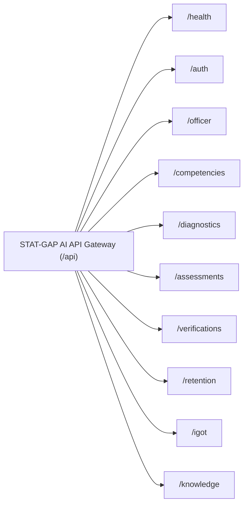

# STAT-GAP AI — Standard API Contract Specification

## 1. Global Standards & Conventions

- **Base URL Prefix**: `/api` (e.g., `http://localhost:8000/api`)
- **Protocol**: HTTP/1.1 (Dev), HTTPS TLS 1.3 (Production)
- **Data Format**: Standard UTF-8 JSON (`Content-Type: application/json`), Multipart Form Data for uploads.
- **Authentication**: Bearer Token in header: `Authorization: Bearer <JWT_TOKEN>`
- **Traceability**: Every request receives or carries an `X-Correlation-ID` header injected into request logs and audit trails.

### Standard Error Response Envelope
```json
{
  "detail": "Descriptive error message safe for client consumption",
  "code": "ERROR_CODE_SLUG",
  "correlation_id": "c1f7b029-4e78-4392-801a-cf2a4d334512",
  "timestamp": "2026-09-16T13:45:00Z"
}
```

---

## 2. API Modules & Endpoint Catalog



### 2.1 Health & Diagnostics
| Method | Endpoint | Description | Auth Required |
|:---|:---|:---|:---:|
| `GET` | `/api/health` | Service health status, database connectivity check. | No |

---

### 2.2 Authentication & Profile (`/api/auth`, `/api/officer`)
| Method | Endpoint | Description | Auth Required |
|:---|:---|:---|:---:|
| `POST` | `/api/auth/login` | Authenticate officer via `igot_id` and password. Returns JWT. | No |
| `POST` | `/api/auth/register` | Register new civil service officer profile. | No |
| `GET` | `/api/auth/me` | Fetch currently authenticated user and profile state. | Yes |
| `GET` | `/api/officer/digital-twin` | Fetch complete structured computational Digital Twin state. | Yes |
| `POST` | `/api/officer/digital-twin/snapshot` | Capture immutable point-in-time Digital Twin state snapshot. | Yes |
| `GET` | `/api/officer/digital-twin/snapshots` | Retrieve timeline history of saved Digital Twin snapshots. | Yes |
| `POST` | `/api/officer/digital-twin/simulate` | Run non-destructive, assumption-based What-If simulation. | Yes |
| `GET` | `/api/officer/competencies` | Fetch deterministic evaluated competency state vector. | Yes |
| `GET` | `/api/officer/competencies/{id}` | Fetch individual evaluated competency with evidence breakdown. | Yes |
| `GET` | `/api/officer/gaps` | Fetch prioritized competency gap deficit list. | Yes |
| `GET` | `/api/officer/evidence` | Fetch multi-source structured evidence ledger with provenance. | Yes |

---

### 2.3 Competencies & Knowledge Graph (`/api/competencies`, `/api/diagnostics`)
| Method | Endpoint | Description | Auth Required |
|:---|:---|:---|:---:|
| `GET` | `/api/competencies` | List all statutory competencies with current officer scores. | Yes |
| `GET` | `/api/competencies/{id}` | Detailed breakdown of a single competency and evidence signals. | Yes |
| `GET` | `/api/competencies/ontology/hierarchy` | Canonical 4-level competency hierarchy (Cadre -> Function -> Competency -> Sub-skill). | Yes |
| `GET` | `/api/competencies/{id}/children` | Direct sub-skills or children nodes for a competency in the graph. | Yes |
| `GET` | `/api/competencies/{id}/dependencies` | Prerequisites and outgoing dependencies with cycle prevention. | Yes |
| `GET` | `/api/diagnostics/competencies` | Fetch multi-source diagnostic evaluation and gap bands for all competencies. | Yes |
| `GET` | `/api/diagnostics/competencies/{id}` | Fetch WHY-GAP diagnosis, reasoning trace, and misconception mapping. | Yes |
| `POST` | `/api/diagnostics/competencies/{id}/evaluate` | Force fresh deterministic re-evaluation of evidence signals. | Yes |

---

### 2.4 Adaptive Assessment Engine (`/api/assessments`)
| Method | Endpoint | Description | Auth Required |
|:---|:---|:---|:---:|
| `POST` | `/api/assessments/start` | Initialize CAT session; returns prior $\theta_0$ and 1st item. | Yes |
| `POST` | `/api/assessments/{session_id}/responses` | Submit item response, update $\hat{\theta}$, return next item or result. | Yes |
| `GET` | `/api/assessments/{session_id}/result` | Fetch finalized psychometric scorecard and stopping reason. | Yes |
| `POST` | `/api/assessments/{session_id}/abandon` | Terminate in-progress session. | Yes |

---

### 2.5 Independent Verification & Knowledge Decay (`/api/verifications`, `/api/retention`)
| Method | Endpoint | Description | Auth Required |
|:---|:---|:---|:---:|
| `GET` | `/api/verifications/status` | List verification status and composite scores across all competencies. | Yes |
| `POST` | `/api/verifications/practical/submit` | Record practical examination / field audit evaluation. | Yes (Assessor/Admin) |
| `POST` | `/api/verifications/evaluate/{competency_id}` | Trigger independent verification gate check. | Yes |
| `GET` | `/api/retention/status` | Fetch Ebbinghaus retention curves and risk levels for all competencies. | Yes |
| `POST` | `/api/retention/refresher/trigger` | Generate 5-minute targeted refresher for at-risk competencies. | Yes |
| `POST` | `/api/retention/refresher/complete` | Submit refresher answers, reset retention to $1.0$, boost stability. | Yes |

---

### 2.6 iGOT & Ministerial Integrations (`/api/igot`)
| Method | Endpoint | Description | Auth Required |
|:---|:---|:---|:---:|
| `GET` | `/api/igot/status` | Current adapter status (`mock` vs `authorized`). | Yes |
| `GET` | `/api/igot/records` | Preview external learning records available for ingestion. | Yes |
| `POST` | `/api/igot/import` | Ingest external records into Digital Twin as external evidence. | Yes |
| `POST` | `/api/igot/export/{competency_id}` | Publish verified competency assertion to external platform. | Yes |
| `GET` | `/api/igot/sync-history` | Fetch immutable audit trail of all synchronization events. | Yes |

---

### 2.7 Knowledge Document Processing & RAG (`/api/knowledge`)
| Method | Endpoint | Description | Auth Required |
|:---|:---|:---|:---:|
| `POST` | `/api/knowledge/documents/upload` | Upload PDF/DOCX/PPTX manual; parse, chunk, embed in pgvector. | Yes (Admin/Authorized) |
| `GET` | `/api/knowledge/documents` | List confirmed indexed documents in vector repository. | Yes |
| `POST` | `/api/knowledge/query` | Test RAG retrieval with similarity scores and grounding status. | Yes |
| `POST` | `/api/knowledge/generate-mcq` | Generate verified, source-traceable MCQ from indexed manual chunks. | Yes |

---

## 3. Sample Payloads

### `POST /api/assessments/{session_id}/responses`
#### Request:
```json
{
  "itemId": "reg_01",
  "selectedAnswer": 1,
  "confidence": "high",
  "responseTimeMs": 14200
}
```
#### Response:
```json
{
  "isCorrect": false,
  "correctAnswer": 0,
  "explanation": "R-squared measures shared variance and association, not direct causality.",
  "thetaAfter": -0.42,
  "standardError": 0.44,
  "itemsAnswered": 2,
  "nextItem": {
    "id": "reg_04",
    "competencyId": "comp_regression_diagnostics",
    "questionType": "multiple_choice",
    "stem": "Which diagnostic test is used to detect heteroskedasticity in OLS residuals?",
    "options": ["A. Breusch-Pagan Test", "B. Durbin-Watson Test", "C. Dickey-Fuller Test", "D. VIF Test"],
    "difficultyLabel": "medium",
    "cognitiveLevel": "application"
  },
  "isCompleted": false,
  "result": null
}
```
