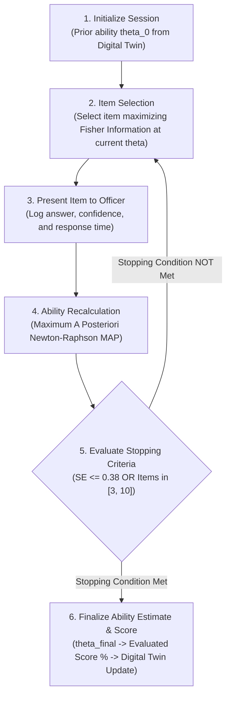

# STAT-GAP AI — Adaptive Assessment & IRT Engine Specification

## 1. Psychometric Foundations: Rasch / 1PL IRT Engine

STAT-GAP AI rejects static, uniform multiple-choice tests. Instead, it implements a genuine **Computerized Adaptive Testing (CAT)** engine based on the **Rasch / 1-Parameter Logistic (1PL) Item Response Theory (IRT)** model.



---

## 2. Mathematical Formulation

### 2.1 The Rasch Response Probability Function
The probability that an officer with latent ability $\theta$ correctly answers an item with difficulty $b$ is:

$$P(\theta, b) = \frac{1}{1 + e^{-(\theta - b)}}$$

**Numerical Safeguards**:
To prevent floating-point overflow in Python, step differences are bounded:
- If $(\theta - b) > 35.0 \implies P = 1.0$
- If $(\theta - b) < -35.0 \implies P = 0.0$

### 2.2 Fisher Item Information
The psychometric information provided by an item at ability level $\theta$ is:

$$I(\theta, b) = P(\theta, b) \cdot (1 - P(\theta, b))$$

The information reaches its maximum ($0.25$) when item difficulty matches officer ability: $\theta = b$.

### 2.3 Maximum A Posteriori (MAP) Ability Estimation
To prevent estimator divergence on all-correct or all-incorrect response vectors (a well-known failure mode of raw Maximum Likelihood Estimation), the engine implements **Maximum A Posteriori (MAP)** estimation with a Gaussian prior $\mathcal{N}(\theta_0, \sigma_{\text{prior}}^2)$:

$$\hat{\theta}_{k+1} = \hat{\theta}_k - \frac{\frac{\partial \ln L_p}{\partial \theta}}{\frac{\partial^2 \ln L_p}{\partial \theta^2}}$$

Where:
- Gradient: $\frac{\partial \ln L_p}{\partial \theta} = \sum_{i=1}^m (u_i - P_i) - \frac{\hat{\theta}_k - \theta_0}{\sigma_{\text{prior}}^2}$
- Hessian: $\frac{\partial^2 \ln L_p}{\partial \theta^2} = - \sum_{i=1}^m P_i(1 - P_i) - \frac{1}{\sigma_{\text{prior}}^2}$
- $u_i \in \{0, 1\}$ is the officer's response (correct/incorrect).
- Standard Error: $SE(\hat{\theta}) = \frac{1}{\sqrt{-\frac{\partial^2 \ln L_p}{\partial \theta^2}}}$

### 2.4 Bounds and Step Damping
- Newton-Raphson update steps are damped to $[-1.2, 1.2]$ to eliminate oscillation.
- Latent ability $\theta$ is strictly clamped to $[\theta_{\min}, \theta_{\max}] = [-4.0, 4.0]$.

---

## 3. Stopping Criteria

The adaptive test dynamically stops when either precision is achieved or testing constraints are met:
1. **Precision Criterion**: Standard Error $SE(\theta) \le 0.38$ (indicating acceptable measurement confidence).
2. **Minimum Item Safeguard**: At least **$3$ items** must be answered, ensuring that multiple sub-skills are tested.
3. **Maximum Item Boundary**: Testing terminates after **$10$ items** to minimize cognitive fatigue on civil service officers.

---

## 4. Distractor Misconception Mapping

Unlike standard tests that treat incorrect responses as identical zeros, STAT-GAP AI items map each distractor to a specific misconception:

```json
{
  "item_id": "reg_01",
  "stem": "An ISS officer fits an OLS regression between State Agricultural Subsidies (X) and Rice Yield (Y), obtaining R-squared = 0.91 and p < 0.001. Which conclusion is statistically valid?",
  "options": [
    "A. 91% of variation in Rice Yield is explained by Subsidies in the sample.",
    "B. Subsidies directly cause 91% of the increase in Rice Yield.",
    "C. The model proves unobserved weather variables have no impact.",
    "D. The regression equation can forecast yield under any economic shock."
  ],
  "correct_index": 0,
  "difficulty_b": 0.45,
  "distractor_misconception_map": {
    "1": "misc_r2_causality",
    "2": "misc_omitted_variable_neglect",
    "3": "misc_overfitting_extrapolation"
  }
}
```

When an officer selects Option B, the system marks the response incorrect, recalibrates $\theta$ downwards, and immediately feeds a signal into the **WHY-GAP engine** that the officer is susceptible to the *Causality-from-Fit Fallacy*.

---

## 5. Psychometric Status & Calibration Disclaimer

> **STATUTORY CALIBRATION TRANSPARENCY**:  
> The current item difficulty parameters ($b$) represent prototype expert estimations. They are designed to demonstrate adaptive psychometric behavior and cognitive trap diagnosis in Smart India Hackathon PS 26101.  
> Operational deployment across MoSPI will require empirical field calibration using Marginally Maximum Likelihood Estimation (MMLE) on nationwide trial cohorts.
