# STAT-GAP AI — Competency Digital Twin Specification

## 1. What is the Competency Digital Twin?

In STAT-GAP AI, the **Competency Digital Twin** is **NOT** a cosmetic 3D avatar, cartoon character, or gamified badge system.

The Digital Twin is a **dynamic, multi-dimensional, mathematically grounded state model** that mirrors an individual officer's true operational capability within India's official statistical apparatus. It is continuously updated from real-world empirical signals (formal assessments, practical field data cleaning, micro-quizzes, and course completions).

```mermaid
flowchart LR
    subgraph Inputs ["Continuous Evidence Signals"]
        E1["Formal IRT Assessments"]
        E2["Adaptive Micro-Quizzes"]
        E3["Practical Data Tasks / Inspections"]
        E4["iGOT & NSSTA Course Evidence"]
    end

    subgraph Twin ["COMPETENCY DIGITAL TWIN"]
        State["Current Proficiency State Vector"]
        Conf["Confidence Calibration Matrix"]
        Miscon["Active Misconception Ledger"]
        Decay["Decay & Stability Trajectories"]
        Deps["Ontological Prerequisite Graph"]
    end

    subgraph Outputs ["Operational Intelligence"]
        O1["Multi-Source Gap Diagnosis"]
        O2["Deterministic Task Readiness Check"]
        O3["Targeted Refresher Triggers"]
        O4["What-If Training Simulation"]
    end

    Inputs --> Twin
    Twin --> Outputs
```



---

## 2. The Twelve Dimensions of the Digital Twin

| # | Digital Twin Dimension | Data Representation | Operational Function |
|:---:|:---|:---|:---|
| **1** | **Current Competency State** | Normalized vector $\vec{C} = [c_1, c_2, \dots, c_n], c_i \in [0.0, 1.0]$ | Live estimated skill proficiencies across statutory competencies. |
| **2** | **Required Competency State** | Statutory benchmark vector $\vec{R} = [r_1, r_2, \dots, r_n], r_i \in [0.0, 1.0]$ | Target standards defined by Cadre (ISS/SSS) and current assignment. |
| **3** | **Gap Vector** | $\vec{G} = \vec{R} - \vec{C}, g_i \in [-1.0, 1.0]$ | Absolute deficit requiring training intervention. |
| **4** | **Confidence Calibration** | Metric $\kappa_i \in [0.0, 1.0]$ with metacognitive pattern classification | Identifies dangerous overconfidence vs. hesitant mastery. |
| **5** | **Evidence Provenance** | Immutable audit chain with source tags, raw scores, and timestamps | Complete evidentiary traceability for every score mutation. |
| **6** | **Active Misconceptions** | Set of diagnosed cognitive traps $\mathcal{M}_i \subset \text{MisconceptionLibrary}$ | Grounded conceptual fallacies detected via assessment distractors. |
| **7** | **Prerequisite Dependencies** | Directed Acyclic Graph (DAG) reachability matrix | Prevents premature advanced learning before prerequisites are met. |
| **8** | **Task Readiness State** | Boolean vector $\vec{T}_{\text{ready}}$ with bottleneck constraint identification | Answers: "Can this officer execute this statutory survey/analytical task?" |
| **9** | **Knowledge Decay Trajectory** | Current retention $R_i(t)$ and stability days $S_i$ | Forecasts when competency will drop below operational threshold. |
| **10** | **Intervention History** | Timeline of completed micro-learning steps, NSSTA modules, and tutorials | Tracks pedagogical history and learning efficiency. |
| **11** | **Reassessment History** | Longitudinal psychometric score trajectories ($\theta$ over time) | Measures learning velocity and long-term retention post-intervention. |
| **12** | **What-If Simulation State** | Hypothetical projected vector $\vec{C}'$ given candidate training plans | Enables predictive decision-making for training nominations. |

---

## 3. Mathematical State Representation

For an officer $u$ at timestamp $t$, the Digital Twin state $\mathcal{DT}_u(t)$ is defined as a set of tuples across all $N$ competencies:

$$\mathcal{DT}_u(t) = \left\{ \langle c_i(t), r_i, g_i(t), \kappa_i(t), \mathcal{M}_{i,u}, S_i(t), R_i(t), \mathcal{E}_{i,u} \rangle \right\}_{i=1}^N$$

Where:
- $c_i(t) = 0.35 \cdot E_{\text{assessment}} + 0.20 \cdot E_{\text{quiz}} + 0.30 \cdot E_{\text{practical}} + 0.15 \cdot E_{\text{external}}$ (normalized to $[0.0, 1.0]$).
- $r_i$ is the statutory required proficiency level (e.g., $0.75$).
- $g_i(t) = \max(0.0, r_i - c_i(t))$ is the non-negative gap.
- $\kappa_i(t)$ is the confidence calibration index.
- $\mathcal{M}_{i,u}$ is the active misconception identifier (if diagnosed).
- $S_i(t)$ is the Ebbinghaus memory stability in days.
- $R_i(t) = \exp(- \Delta t / S_i(t))$ is current retention probability.
- $\mathcal{E}_{i,u}$ is the list of evidence records with cryptographic timestamps.

---

## 4. Task Readiness Engine

A critical capability of the Digital Twin is answering the supervisory question:
> **"Can this officer currently perform a required official statistical task?"**

### 4.1 Multi-Competency Constraint Evaluation
A statutory task $T$ requires a vector of minimum threshold proficiencies:

$$T = \left\{ (k_j, \tau_j) \right\}_{j=1}^m$$

Where $k_j$ is the required competency and $\tau_j$ is the required threshold.

**Example Task: "Design a Stratified Multi-Stage Sample (PLFS)"**
- `comp_survey_sampling` $\ge 0.80$
- `comp_stat_inference` $\ge 0.75$
- `comp_data_cleaning` $\ge 0.70$

### 4.2 Deterministic Constraint Algorithm
```python
def evaluate_task_readiness(officer_twin, task_requirements):
    bottlenecks = []
    for comp_id, threshold in task_requirements.items():
        current_prof = officer_twin.get_proficiency(comp_id)
        current_retention = officer_twin.get_retention(comp_id)
        
        # Effective proficiency factoring in decay
        effective_proficiency = current_prof * current_retention
        
        if effective_proficiency < threshold:
            bottlenecks.append({
                "competency_id": comp_id,
                "current_effective": round(effective_proficiency, 3),
                "required_threshold": threshold,
                "deficit": round(threshold - effective_proficiency, 3)
            })
            
    is_ready = len(bottlenecks) == 0
    # Identify the primary constraining competency (highest deficit)
    constraining_competency = max(bottlenecks, key=lambda x: x["deficit"]) if bottlenecks else None
    
    return {
        "is_ready": is_ready,
        "bottlenecks": bottlenecks,
        "constraining_competency": constraining_competency
    }
```

This logic is **100% deterministic, explainable, and audit-compliant**. It avoids subjective managerial bias in assigning field officers to complex survey duties.

---

## 5. What-If Training Simulation

The Digital Twin supports simulation of training interventions before committing officer time or budget:

1. **Input**: Proposed intervention (e.g., "Assign 5-day NSSTA Advanced Sampling Workshop").
2. **Transfer Model**: Estimated gain $\Delta c_i = \delta \cdot (1.0 - c_i)$ based on historical training outcome curves.
3. **Simulation**: Project $\vec{C}' = \vec{C} + \Delta \vec{C}$ and recompute task readiness vectors $\vec{T}'_{\text{ready}}$.
4. **Output**: Projected gap reduction and unlocked statutory tasks.
