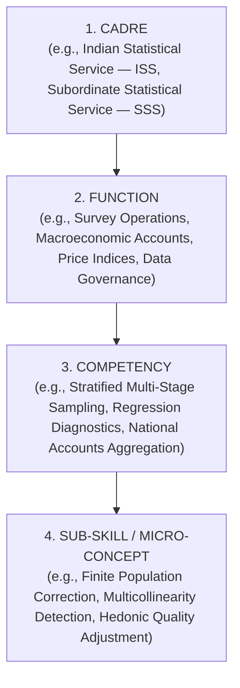
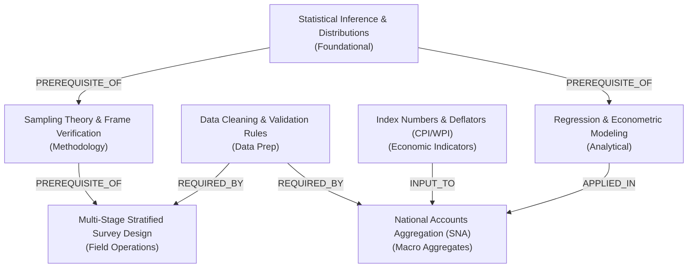

# STAT-GAP AI — Competency Model & Statistical Knowledge Graph

## 1. Domain-Native Competency Hierarchy

India's Official Statistical System operates under statutory mandates defined by the Ministry of Statistics and Programme Implementation (MoSPI). The competency model is structured in a strict **4-tier domain hierarchy**:



### 1.1 Cadre Specializations
- **Indian Statistical Service (ISS)**: Cadre responsible for statistical policy formulation, national accounts compilation, survey design, econometrics, high-level analysis, and dissemination.
- **Subordinate Statistical Service (SSS)**: Cadre responsible for field execution, primary survey administration (PLFS, ASI), preliminary data validation, and district/state statistical coordination.
- **Field Operations Division (FOD) Investigators**: Specialized personnel executing ground-level sampling, establishment listing, and primary household interviews.

### 1.2 Core Statistical Functions
1. **Core Statistical Methodology & Inference**
2. **Survey Sampling & Field Operations**
3. **Macroeconomic Accounts & National Aggregates**
4. **Price Statistics & Index Number Methodology**
5. **Data Cleaning, Imputation & Validation**
6. **Data Governance, NDSAP Standards & Metadata**

---

## 2. Competency Node Specification

Every competency entity within STAT-GAP AI stores rich multidimensional state:

```json
{
  "id": "comp_regression_diagnostics",
  "name": "Regression Analysis & Econometric Diagnostics",
  "category": "Core Methodology",
  "cadre": "ISS",
  "function": "Economic Statistics & Modeling",
  "required_level": 0.75,
  "current_estimated_level": 0.48,
  "confidence": 0.88,
  "gap_score": 0.27,
  "status": "critical_gap",
  "requires_practical_verification": true,
  "prerequisites": [
    "comp_stat_inference",
    "comp_matrix_algebra_basics"
  ],
  "associated_misconceptions": [
    "misc_r2_causality_fallacy",
    "misc_p_value_effect_size"
  ],
  "evidence_signals": {
    "assessment_score": 0.45,
    "quiz_accuracy": 0.50,
    "practical_performance": 0.40,
    "external_evidence": 0.60,
    "repeated_errors": 2,
    "confidence_pattern": "Overconfident: High confidence on flawed items"
  },
  "decay_parameters": {
    "stability_days": 42.5,
    "last_interaction_timestamp": "2026-08-15T10:00:00Z",
    "calculated_retention": 0.58,
    "risk_level": "at_risk"
  },
  "sub_skills": [
    {
      "id": "sub_multicollinearity_vif",
      "name": "Variance Inflation Factor (VIF) Interpretation",
      "proficiency": 0.40
    },
    {
      "id": "sub_heteroskedasticity_breusch_pagan",
      "name": "Heteroskedasticity & Residual Diagnostics",
      "proficiency": 0.55
    }
  ]
}
```

---

## 3. Official Statistical Knowledge Graph

The Competency Knowledge Graph models directional dependencies and conceptual relationships between statistical competencies, preventing officers from attempting advanced methodologies without foundational prerequisites.



### 3.1 Relationship Types
1. `PREREQUISITE_OF`: Competency $A$ must reach proficiency $\ge 0.70$ before Competency $B$ can be certified.
2. `APPLIED_IN`: Practical application of theoretical competency in a specific operational domain.
3. `CONSTRAINS`: Deficit in Competency $A$ deterministically blocks task readiness in dependent task $T$.
4. `MUTUALLY_REINFORCING`: Cross-domain competencies whose joint mastery enhances cognitive stability $S$.

---

## 4. Statutory Competency Catalog for India's Official Statistics

| Competency ID | Competency Name | Primary Cadre | Function | Required Benchmark | Practical Exam Required? |
|:---|:---|:---|:---|:---:|:---:|
| `comp_stat_inference` | Statistical Inference & Parametric Testing | ISS / SSS | Core Methodology | $0.75$ | No |
| `comp_survey_sampling` | Multi-Stage Stratified Survey Design | ISS / FOD | Field Operations | $0.80$ | Yes |
| `comp_data_cleaning` | Data Cleaning, Imputation & Outlier Detection | SSS / ISS | Data Operations | $0.75$ | Yes |
| `comp_regression_diagnostics` | Econometric Regression & Residual Diagnostics | ISS | Economic Statistics | $0.75$ | Yes |
| `comp_national_accounts` | National Accounts Compilation (SNA 2008) | ISS | Macro Statistics | $0.80$ | Yes |
| `comp_price_indices` | Index Number Theory & Price Aggregations | ISS / SSS | Price Statistics | $0.75$ | No |
| `comp_data_governance` | Data Governance, NDSAP Standards & PII Masking | All Cadres | Standards & Policy | $0.70$ | No |

---

## 5. Storage & Graph Schema in PostgreSQL

The knowledge graph is modeled relationally to ensure high-performance recursive queries using PostgreSQL Common Table Expressions (CTEs):

```sql
CREATE TABLE competency_nodes (
    id VARCHAR(64) PRIMARY KEY,
    name VARCHAR(255) NOT NULL,
    category VARCHAR(255) NOT NULL,
    cadre VARCHAR(64) NOT NULL DEFAULT 'ALL',
    function VARCHAR(255) NOT NULL,
    required_level DOUBLE PRECISION NOT NULL DEFAULT 0.75,
    description TEXT,
    requires_practical BOOLEAN NOT NULL DEFAULT FALSE,
    created_at TIMESTAMP WITH TIME ZONE DEFAULT CURRENT_TIMESTAMP
);

CREATE TABLE competency_relationships (
    id SERIAL PRIMARY KEY,
    source_node_id VARCHAR(64) REFERENCES competency_nodes(id) ON DELETE CASCADE,
    target_node_id VARCHAR(64) REFERENCES competency_nodes(id) ON DELETE CASCADE,
    relationship_type VARCHAR(64) NOT NULL, -- 'PREREQUISITE_OF', 'APPLIED_IN', etc.
    weight DOUBLE PRECISION NOT NULL DEFAULT 1.0,
    created_at TIMESTAMP WITH TIME ZONE DEFAULT CURRENT_TIMESTAMP,
    CONSTRAINT uq_graph_edge UNIQUE (source_node_id, target_node_id, relationship_type)
);
```
