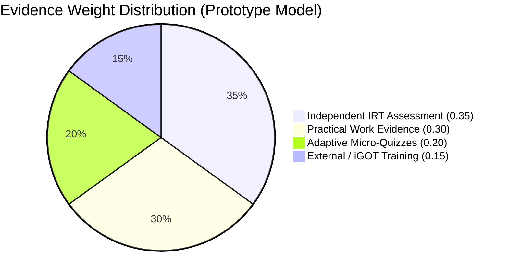
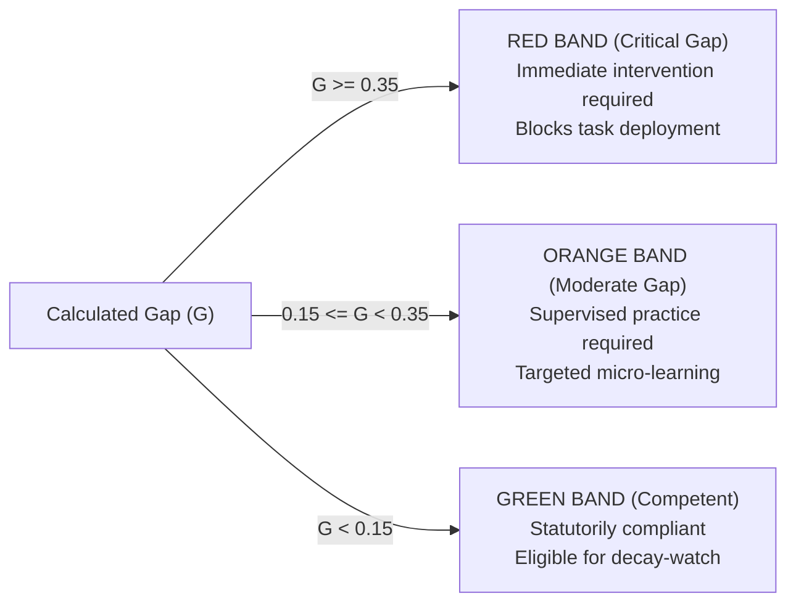

# STAT-GAP AI — Weighted Gap Engine Specification

## 1. Prototype Weighted Evidence Model

The core estimation of an officer's competency proficiency is computed through a multi-source weighted evidence formulation. All input metrics and outputs are normalized to the closed interval $[0.0, 1.0]$.

### 1.1 The Prototype Formula

$$\text{Current Competency } (C) = 0.35 \cdot E_{\text{assessment}} + 0.20 \cdot E_{\text{quiz}} + 0.30 \cdot E_{\text{practical}} + 0.15 \cdot E_{\text{external}}$$



### 1.2 Description of Evidence Sources

| Evidence Component | Symbol | Weight | Measurement Source & Criteria | Normalization Rule |
|:---|:---:|:---:|:---|:---|
| **Independent Assessment** | $E_{\text{assessment}}$ | **$0.35$** | Formal adaptive psychometric evaluation using Item Response Theory (IRT 1PL/Rasch). Evaluates rigorous theoretical and analytical grasp. | Latent ability $\theta \in [-4.0, 4.0]$ mapped to $[0.0, 1.0]$ via logistic transformation: $E_{\text{assessment}} = \frac{1}{1 + e^{-\theta}}$. |
| **Adaptive Quiz** | $E_{\text{quiz}}$ | **$0.20$** | Frequent formative micro-assessments and diagnostic checkpoints embedded in study modules. | $\text{Correct Items} / \text{Total Attempted Items} \in [0.0, 1.0]$. |
| **Practical Evidence** | $E_{\text{practical}}$ | **$0.30$** | Authentic civil service performance data: field survey data validation, synthetic cleaning exercises, outlier treatment, and table compilation. | Standardized score on rubric checklist $\in [0.0, 1.0]$. |
| **External Evidence** | $E_{\text{external}}$ | **$0.15$** | Ingested course completions and assessments from external authorized platforms (iGOT Karmayogi, NSSTA in-person workshops). | Normalized grade or completion verification score $\in [0.0, 1.0]$. |

---

## 2. Gap Calculation & Traffic-Light Visualization

### 2.1 Gap Definition
The competency gap $G$ is the difference between the statutory required proficiency benchmark $R$ and the officer's current estimated proficiency $C$:

$$\text{Gap } (G) = R - C$$

Where:
- $R \in [0.0, 1.0]$ (typically $0.75$ or $0.80$ depending on cadre and function).
- $C \in [0.0, 1.0]$.
- $G \in [-1.0, 1.0]$. For visualization and prioritization, negative gaps (where the officer exceeds the benchmark) are treated as zero deficit: $G_{\text{display}} = \max(0.0, G)$.

### 2.2 Standardized Visualization Bands



| Visual Band | Gap Threshold | Operational Civil Service Classification | Recommended Action |
|:---:|:---:|:---|:---|
| **RED** | $\mathbf{G \ge 0.35}$ | **Critical Competency Gap** | Immediate pedagogical intervention required. Officer is statutorily constrained from unsupervised task assignment. |
| **ORANGE** | $\mathbf{0.15 \le G < 0.35}$ | **Moderate Competency Gap** | Minor procedural or conceptual deficit. Supervised practice and targeted micro-learning recommended. |
| **GREEN** | $\mathbf{G < 0.15}$ | **Competent / Statutorily Compliant** | Officer meets or exceeds required operational proficiency. Transition to knowledge decay monitoring. |

---

## 3. Parametric Extensibility & Calibration Integrity

### 3.1 Prototype Disclaimer
> **IMPORTANT NOTE ON CALIBRATION**:  
> The weights $(0.35, 0.20, 0.30, 0.15)$ and thresholds $(0.35, 0.15)$ are **configurable prototype parameters**. They are designed for demonstration and architectural validation in Smart India Hackathon PS 26101.  
> They do **NOT** represent empirically validated psychometric constants. In operational government deployment, these weights will be calibrated against empirical field performance data through longitudinal regression analysis.

### 3.2 Configuration Schema
In the backend, all weights and thresholds are declared in `backend/app/core/config.py` and can be overridden via environment variables or runtime settings:

```python
class Settings(BaseSettings):
    # Core Gap Model Weights (Sum must equal 1.0)
    GAP_WEIGHT_ASSESSMENT: float = 0.35
    GAP_WEIGHT_QUIZ: float = 0.20
    GAP_WEIGHT_PRACTICAL: float = 0.30
    GAP_WEIGHT_EXTERNAL: float = 0.15

    # Visualization Thresholds
    GAP_THRESHOLD_RED: float = 0.35    # Gap >= 0.35 -> Red
    GAP_THRESHOLD_ORANGE: float = 0.15 # 0.15 <= Gap < 0.35 -> Orange
```

### 3.3 Reconciliation with Legacy Implementation
The early prototype in `backend/app/services/evaluation_service.py` implemented a legacy 3-factor formula:
$$\text{Score}_{0-100} = 0.40 \cdot \text{Assessment} + 0.30 \cdot \text{Quiz} + 0.30 \cdot \text{Practical}$$
During Phase 1/3, the evaluation service will be gracefully transitioned to the standard 4-factor normalized $[0.0, 1.0]$ model with complete backward compatibility.
