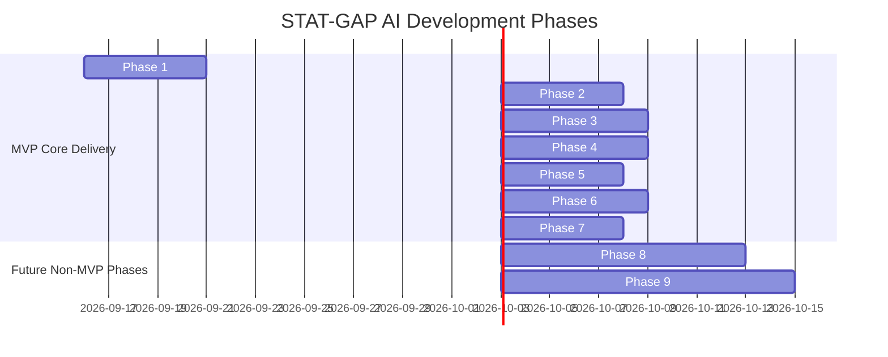

# STAT-GAP AI — Implementation Roadmap & Delivery Plan

## 1. Master Phased Roadmap

---

## 2. Phase-by-Phase Deliverables & Verification Gates

### Phase 1: Stabilize Existing Application + Backend Foundation
- **Focus**: Harmonize ports, environment configuration, database session handling, and frontend-backend client contracts. Run full test suite.
- **Deliverables**:
  1. Standardized root configuration and environment files (`.env`, `backend/.env`).
  2. Harmonized CORS origins across Vite default (5173), legacy (3000), and current dev server (3001).
  3. Clean separation of frontend client calls (`apiClient.ts`) to backend endpoints without silent local storage fallbacks when backend is available.
  4. 100% pass rate on existing 119 backend automated unit and integration tests.
- **Exit Criteria**: Frontend loads seamlessly against local FastAPI backend; `/api/health` reports online; all existing tests pass green.

---

### Phase 2: PostgreSQL & Authentication / Security Foundation
- **Focus**: Validate PostgreSQL schema migrations (Alembic), Argon2id hashing, and JWT token rotation.
- **Deliverables**:
  1. Alembic migration scripts ensuring tables (`users`, `officer_profiles`, `audit_events`) exist with correct foreign keys.
  2. RBAC middleware verifying roles (`OFFICER`, `ASSESSOR`, `TRAINING_ADMIN`, `SUPER_ADMIN`).
  3. Startup security guards enforcing 32+ character high-entropy JWT secrets.
  4. Complete profile management endpoints (`GET /api/auth/me`, `PUT /api/officer/profile`).
- **Exit Criteria**: Secure login and registration verified against PostgreSQL; unauthorized cross-officer queries return 404.

---

### Phase 3: Competency Intelligence + Knowledge Graph + Digital Twin + Gap Engine
- **Focus**: Implement the standard 4-factor Gap Engine ($0.35, 0.20, 0.30, 0.15$), recursive Knowledge Graph repository, and 12-dimensional Digital Twin state.
- **Deliverables**:
  1. Updated `CompetencyEvaluationService` computing normalized scores in $[0.0, 1.0]$.
  2. Traffic-light gap classifier (Red $\ge 0.35$, Orange $[0.15, 0.35)$, Green $< 0.15$).
  3. Knowledge Graph DAG queries for prerequisite checking (`PREREQUISITE_OF`).
  4. Digital Twin state aggregation endpoint (`GET /api/officer/digital-twin`).
- **Exit Criteria**: Digital Twin accurately reflects multi-source evidence; gap calculation matches PRD specifications.

---

### Phase 4: LLM + Grounded RAG + Misconception Intelligence + WHY-GAP
- **Focus**: Ingestion pipeline for official MoSPI manuals (PDF/DOCX/PPTX) into pgvector, 3-tier Grounding Gate, and WHY-GAP diagnostic explanations.
- **Deliverables**:
  1. Document ingestion and chunking parser (`pypdf`, `python-docx`, `python-pptx`).
  2. `pgvector` similarity search with cosine distance and metadata filtering.
  3. 3-tier grounding verification gate ($\ge 0.65$ Grounded, $[0.48, 0.65)$ Weak, $< 0.48$ Insufficient/Refusal).
  4. Misconception Library integration and grounded explanation generation.
- **Exit Criteria**: Zero hallucinations on ungrounded queries; valid explanations cite exact document, section, and page.

---

### Phase 5: Adaptive Assessment Engine + IRT / Knowledge Tracing
- **Focus**: Computerized Adaptive Testing (CAT) via Rasch/1PL model with Maximum A Posteriori (MAP) ability estimation and Fisher information item selection.
- **Deliverables**:
  1. IRT mathematical engine (`rasch_probability`, `item_information`, `estimate_ability_map`).
  2. Item selection algorithm optimizing Fisher information around current $\hat{\theta}$.
  3. Dynamic stopping criteria ($SE \le 0.38$ or item range $[3, 10]$).
  4. Distractor misconception mapping feeding into WHY-GAP engine.
- **Exit Criteria**: Assessment difficulty adapts in real time based on user responses; final ability maps to evaluated competency score.

---

### Phase 6: Independent Verification + Task Readiness + Knowledge Decay
- **Focus**: Dual-gate independent competency certification, deterministic task readiness constraint evaluation, and Ebbinghaus decay monitoring.
- **Deliverables**:
  1. Independent verification service enforcing score thresholds ($75\%$ composite, $70\%$ independent, $60\%$ practical).
  2. Deterministic Task Readiness evaluator identifying constraining competency bottlenecks.
  3. Knowledge Decay engine computing retention $R(t) = e^{-t/S}$ with dynamic stability $S \in [30, 95]$ days.
  4. Automated 5-minute refresher triggers when retention drops below $0.60$.
- **Exit Criteria**: Expired or decayed competencies deterministically suspend task readiness; completing a refresher restores retention to $1.0$.

---

### Phase 7: iGOT Integration Layer + NSSTA / TPAC Training Ecosystem
- **Focus**: Complete adapter architecture, honest mock/real boundaries, and national training calendar alignment.
- **Deliverables**:
  1. `MockIgotAdapter` and `RealIgotAdapter` adhering to `IGOTAdapter` contract.
  2. Clean separation preventing fabricated sync claims.
  3. NSSTA calendar and TPAC course recommendation engine mapped to competency deficits.
  4. Comprehensive audit logging for all synchronization events.
- **Exit Criteria**: Full end-to-end integration lifecycle demonstrated with complete ministerial traceability.

---

## 3. Future Phases (Explicitly Post-MVP / Non-Blocking)

### Phase 8: Training Optimization / CATO (Competency-Aware Training Optimization)
- **Scope**: Mathematical optimization model for civil service training allocation.
- **Components**:
  - Training impact modeling: predicting expected $\Delta \theta$ per training rupee and training hour.
  - Multi-objective constraint solver: maximizing cadre readiness under budgetary and operational leave constraints.
  - Workforce-level training plan generator.
- **Status**: **NOT an MVP dependency. Scheduled post-hackathon.**

### Phase 9: Advanced Platform Capabilities
- **Scope**:
  - Multilingual voice-assisted AI tutor for regional field investigators.
  - Interactive virtual statistical laboratories with live dataset manipulation.
  - Long-term civil service demographic forecasting and future skill demand modeling.
- **Status**: **NOT an MVP dependency. Kept strictly decoupled.**

---

## 4. Phase 1 Implementation Plan — Status: COMPLETED

| Step | Objective | Files Targeted | Status / Verification |
|:---:|:---|:---|:---|
| **1.1** | **Harmonize Ports & Environment** | `vite.config.ts`, `backend/.env.example`, `src/services/apiClient.ts` | **COMPLETED**: Ports 3000, 3001, and 5173 whitelisted in backend CORS. Backend on port 8000. `apiClient.isAvailable` probe added. |
| **1.2** | **Test Virtualenv Standardization** | `backend/requirements.txt`, pytest scripts | **COMPLETED**: 131 tests executed with virtualenv python. 100% pass rate achieved in 17.52s. |
| **1.3** | **Unify Scoring Models** | `backend/app/services/evaluation_service.py`, `src/services/competencyService.ts` | **COMPLETED**: 4-factor normalized model ($0.35/0.20/0.30/0.15$) implemented with non-negative sum-to-1 validation and Red ($\ge 0.35$), Orange ($[0.15, 0.35)$), Green ($< 0.15$) bands. Full backward compatibility maintained. |
| **1.4** | **Frontend Routing & Prop Hardening** | `src/App.tsx`, `Sidebar.tsx`, `Header.tsx` | **COMPLETED**: Browser subagent smoke test verified all 10 core pages without any runtime errors or console exceptions. |
| **1.5** | **Documentation Baseline Verification** | `docs/*.md` | **COMPLETED**: All 13 core specification documents plus `PHASE1_BASELINE.md` complete and synchronized. |
