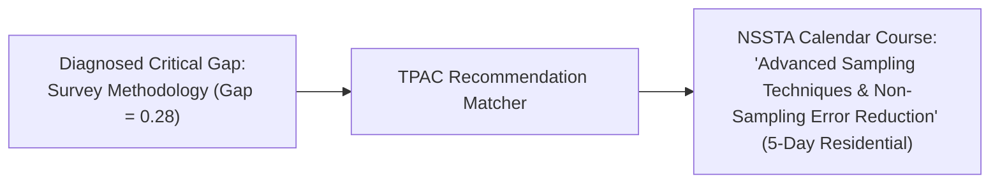
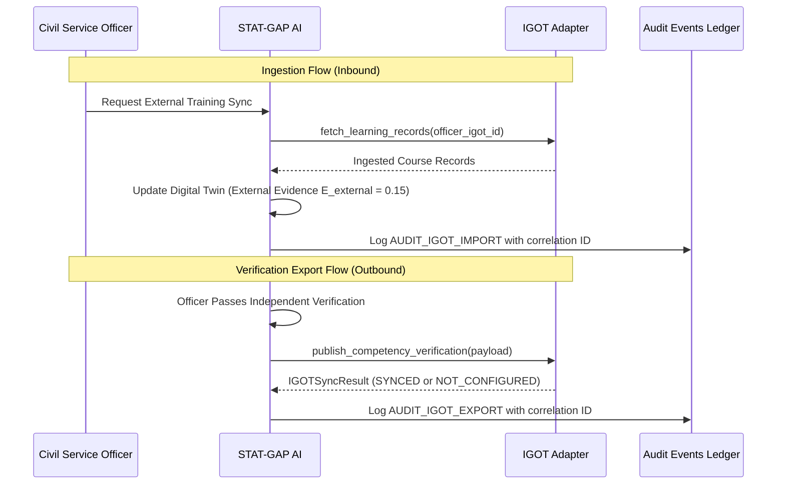

# STAT-GAP AI — Integration Architecture (iGOT, NSSTA, TPAC)

## 1. Statutory Architectural Boundary Principles

As an evidence-driven platform designed for India's Official Statistical System, STAT-GAP AI operates under strict boundary integrity principles:

1. **NO Invented Government Endpoints**: The system does **NOT** invent fake ministerial API URLs (e.g., `https://api.igotkarmayogi.gov.in/v1/fake`) or pretend that private government data bridges exist in the prototype.
2. **Pluggable Adapter Pattern**: All external learning platforms and training institutes interface with STAT-GAP AI through a standardized, abstract **Adapter Contract**.
3. **Honest Mock vs. Real Boundaries**:
   - In prototype / hackathon mode, the platform utilizes `MockIgotAdapter` with realistic, structured civil service scenarios.
   - When configured for live production, `RealIgotAdapter` connects strictly to authorized, provisioned ministerial gateways. If credentials or endpoints are unconfigured, it reports an explicit `NOT_CONFIGURED` status and **never fabricates a fake "synced" success**.

```mermaid
flowchart TD
    Core["STAT-GAP AI Core Intelligence Engine"]
    
    subgraph AdapterInterface ["Standardized Training Platform Contract (IGOTAdapter)"]
        Interface["<<Interface>>\nIGOTAdapter\n+ fetch_learning_records(officer_id)\n+ fetch_course_completion(ref_id)\n+ publish_competency_verification(payload)\n+ publish_learning_status(officer_id, comp_id, status)"]
    end

    subgraph Implementations ["Adapter Implementations"]
        MockAdapter["MockIgotAdapter\n(Deterministic civil service test records)"]
        RealAdapter["RealIgotAdapter\n(Strict boundary; raises NOT_CONFIGURED\nunless official ministerial credentials supplied)"]
        NSSTAAdapter["NSSTAAdapter\n(National Statistical Systems Training Academy\nCalendar & Course Ingestion)"]
        TPACAdapter["TPACProgrammeCatalogue\n(Training Programme Advisory Committee\nCurriculum & Competency Alignment)"]
    end

    Core <--> Interface
    Interface <|-- MockAdapter
    Interface <|-- RealAdapter
    Interface <|-- NSSTAAdapter
    Interface <|-- TPACAdapter
```

---

## 2. The Abstract Adapter Contract

Defined in `backend/app/integrations/igot/igot_adapter.py`:

```python
class IGOTAdapter(ABC):
    @abstractmethod
    def fetch_learning_records(self, officer_igot_id: str) -> List[IGOTLearningRecord]:
        """Fetches completed learning records for a specific officer."""
        pass

    @abstractmethod
    def fetch_course_completion(
        self, external_reference_id: str, officer_igot_id: str
    ) -> Optional[IGOTCourseCompletion]:
        """Fetches detailed completion evidence for a specific course reference."""
        pass

    @abstractmethod
    def publish_competency_verification(
        self, export_payload: IGOTCompetencyExport
    ) -> IGOTSyncResult:
        """Publishes verified competency status to the external platform."""
        pass

    @abstractmethod
    def publish_learning_status(
        self, officer_igot_id: str, competency_id: str, status: str
    ) -> IGOTSyncResult:
        """Publishes learning progress status to the external platform."""
        pass
```

---

## 3. Real Adapter Boundary Behavior

When `IGOT_MODE="authorized"`, `RealIgotAdapter` activates. Its behavior is strictly guarded:

```python
class RealIGOTAdapter(IGOTAdapter):
    def publish_competency_verification(self, export_payload: IGOTCompetencyExport) -> IGOTSyncResult:
        if not self.is_configured:
            return IGOTSyncResult(
                status=IGOTSyncStatus.NOT_CONFIGURED,
                operation="export_competency_verification",
                error_code="IGOT_NOT_CONFIGURED",
                message="Real iGOT export not configured. Live ministerial API credentials required.",
                correlation_id=export_payload.correlation_id,
            )
        # Authenticated HTTPS request executed here once ministerial gateway is provisioned
```

This guarantees that STAT-GAP AI maintains full architectural compliance without misrepresenting its external connectivity during official hackathon evaluation.

---

## 4. NSSTA & TPAC Training Recommendations

The platform maps official residential and virtual courses offered by the **National Statistical Systems Training Academy (NSSTA)** and recommended by the **Training Programme Advisory Committee (TPAC)** directly to diagnosed competency gaps:



| Competency Deficit | Recommended NSSTA Course | TPAC Priority Level | Delivery Format |
|:---|:---|:---:|:---:|
| `comp_survey_sampling` | Advanced Sampling Techniques & Frame Verification | Priority 1 (Mandatory) | Residential (NSSTA Greater Noida) |
| `comp_national_accounts` | Compilation of Gross State Domestic Product (GSDP) & SNA 2008 | Priority 1 (Mandatory) | Hybrid Workshop |
| `comp_price_indices` | Item Selection & Hedonic Pricing in CPI/WPI | Priority 2 (Elective) | Virtual e-Learning |
| `comp_data_cleaning` | Deterministic & Probabilistic Imputation for NSS Data | Priority 1 (Mandatory) | Computer Lab Intensive |

---

## 5. Bidirectional Data Flow & Audit Trail


