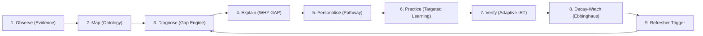

# STAT-GAP AI — Product Requirements Document (PRD)

**Project Title**: STAT-GAP AI: Evidence-Driven, Domain-Native Competency Intelligence Platform for India's Official Statistical System  
**Problem Statement**: Smart India Hackathon PS 26101  
**Target Ministry**: Ministry of Statistics and Programme Implementation (MoSPI) / Data Informatics & Innovation Division (DIID)  
**Target User Cadres**: Indian Statistical Service (ISS), Subordinate Statistical Service (SSS), Field Operations Division (FOD) investigators, and MoSPI statistical personnel.

---

## 1. Executive Summary & Problem Context

India's official statistical machinery is responsible for vital national indicators—including the Gross Domestic Product (GDP), Consumer Price Index (CPI), Periodic Labour Force Survey (PLFS), and Annual Survey of Industries (ASI). The integrity, reliability, and precision of these national datasets depend fundamentally on the technical proficiency and rigorous procedural compliance of statistical officers.

### The Core Problem
1. **LMS vs. True Competency**: Traditional Learning Management Systems (including baseline iGOT Karmayogi deployments) track **course enrollments, viewing time, and generic certificate completion**. They do NOT capture **task readiness, empirical skill mastery, procedural compliance, or conceptual fallacies**.
2. **Invisible Knowledge Decay**: An officer trained on complex multi-stage stratified sampling or hedonic regression imputation two years ago experiences natural cognitive decay. Current systems have no predictive or empirical mechanism to monitor retention.
3. **Absence of Root-Cause Explanations**: When an officer produces flawed survey estimates or misinterprets econometric outputs, current supervisory audits identify the error but cannot diagnose **WHY** the error occurred (e.g., confusing standard deviation with standard error, or treating $R^2$ as an indicator of causal validity).
4. **Disjointed Training Ecosystem**: National training institutes—such as the National Statistical Systems Training Academy (NSSTA) and programs recommended by the Training Programme Advisory Committee (TPAC)—operate in silos separate from day-to-day work assessments.

### The Solution: STAT-GAP AI
STAT-GAP AI is an evidence-driven, domain-native competency intelligence platform. It maintains a **Competency Digital Twin** for each officer, computes multi-source weighted skill gaps, diagnoses underlying statistical misconceptions through explainable AI (WHY-GAP), adapts psychometric evaluations via Item Response Theory (IRT), triggers proactive refresher learning based on Ebbinghaus decay modeling, and interfaces with iGOT and NSSTA via clean adapter architectures.

---

## 2. Core Operating Paradigm: The STAT-GAP Loop

STAT-GAP AI is **NOT** a generic learning portal or chatbot. It operates on a continuous, closed-loop diagnostic and reinforcement cycle:

1. **Observe**: Continuously ingest multi-source evidence (formal assessments, micro-quizzes, practical work samples, and external training completions).
2. **Map**: Align empirical evidence to the national statistical competency ontology (Cadre $\rightarrow$ Function $\rightarrow$ Competency $\rightarrow$ Sub-skill).
3. **Diagnose**: Deterministically compute competency proficiencies and gap points against statutory target benchmarks.
4. **Explain (WHY-GAP)**: Trace the gap to its conceptual root cause using the Statistical Misconception Library and knowledge graph prerequisites.
5. **Personalise**: Recommend tailored micro-learning pathways and NSSTA/TPAC training modules addressing the exact diagnosed misconception.
6. **Practice**: Officer engages with grounded curriculum materials derived strictly from authorized MoSPI/NSSTA manuals.
7. **Verify**: Conduct independent, adaptive psychometric assessment (IRT Rasch 1PL) to verify true competency acquisition.
8. **Decay-Watch**: Track post-verification retention using empirical Ebbinghaus decay modeling with score-dependent stability factors.
9. **Refresher Trigger**: Dispatch proactive, micro-assessment alerts before knowledge decays below statutory operational thresholds.
10. **Re-diagnose**: Update the Competency Digital Twin state dynamically.

---

## 3. Mandatory Functional Requirements

| ID | Requirement Area | Statutory Capability & Scope |
|:---|:---|:---|
| **FR-01** | **Officer Competency Assessment** | Support multi-dimensional evaluation of statistical officers across core methodologies, field operations, standards, and data governance. |
| **FR-02** | **Competency Gap Identification** | Deterministically compute skill gaps using weighted multi-source evidence normalized to $[0.0, 1.0]$. Visualize through standardized traffic-light status bands (Red, Orange, Green). |
| **FR-03** | **Explainable WHY-GAP Diagnosis** | Provide deterministic, rule-supported diagnosis linking gap signals to the Statistical Misconception Library, explaining the cognitive fallacy without LLM hallucination. |
| **FR-04** | **Personalized Learning Interventions** | Synthesize tailored learning pathways sequenced by prerequisite dependencies in the statistical knowledge graph. |
| **FR-05** | **iGOT Karmayogi Adapter Ecosystem** | Ingest learning history and export verified competencies via a pluggable adapter interface (`MockIgotAdapter` / `RealIgotAdapter`). Zero fabricated sync claims. |
| **FR-06** | **NSSTA & TPAC Programme Integration** | Map official NSSTA calendar courses and TPAC recommendations to specific diagnosed competency deficits. |
| **FR-07** | **Grounded RAG & MCQ Generation** | Ingest authorized documents (PDF, DOCX, PPTX). Enforce a 3-tier grounding similarity gate ($\ge 0.65$ Grounded, $[0.48, 0.65)$ Weak, $< 0.48$ Insufficient). Refuse generation when grounding is insufficient. |
| **FR-08** | **Adaptive Psychometric Assessment** | Implement 1-Parameter Logistic (Rasch) IRT with Maximum A Posteriori (MAP) ability estimation and Fisher information item selection. |
| **FR-09** | **Independent Competency Verification** | Enforce a separate verification gate combining psychometric assessment and practical evaluation before certifying competency. |
| **FR-10** | **Knowledge Decay Monitoring** | Compute retention curves $R(t) = R_0 \cdot e^{-t/S}$ with dynamic stability $S \in [30, 95]$ days. Trigger automated refreshers when retention breaches warning thresholds. |
| **FR-11** | **Role-Based Dashboards** | Deliver tailored interfaces: Officer Self-Service (Twin, Gaps, Refreshers, Practice) and Administrative / Supervisor Analytics (cadre readiness, aggregate gap heatmaps). |
| **FR-12** | **Task Readiness Intelligence** | Evaluate whether an officer can execute a complex statistical task (e.g., "Design a Stratified Sample") based on multi-competency constraint thresholds. |

---

## 4. Non-Functional & Governance Requirements

### 4.1 Strict Architectural Separation of Concerns
- **Deterministic / Programmatic Logic**: MUST be the sole authority for scoring, gap calculation, status classification, threshold checks, access permissions, verification state, decay forecasting, and audit recording.
- **Artificial Intelligence / LLM**: Confined strictly to semantic interpretation, grounded tutoring, natural language explanations from retrieved sources, and question drafting. **The LLM must never decide whether an officer passes or fails.**

### 4.2 Security & Data Hygiene
- **Authentication**: Argon2id password hashing and cryptographically signed JWTs (minimum 32-character high-entropy secret).
- **Multi-Tenancy & Privacy**: Strict authorization boundaries. Officers can only access their own records.
- **Audit Logging**: Immutable, tamper-evident audit logs (`audit_events`) capturing all assessment submissions, verification state changes, and sync actions.
- **Data Minimization & Non-Punitive Analytics**: Administrative dashboards must provide aggregate cadre-level analytics without exposing punitive individual rankings.

### 4.3 Prototype & Calibration Integrity
- Prototype parameters (weights, IRT parameters, decay half-lives) must be explicitly identified as configurable prototype defaults.
- No artificial claims of "99.4% psychometric precision" or live government API connections when mock adapters are active.

---

## 5. Phased Roadmap Scope

- **Phase 1**: Codebase stabilization, architectural alignment, contract unification, test suite execution.
- **Phase 2**: PostgreSQL + pgvector schema validation, security hardening, RBAC.
- **Phase 3**: Competency Knowledge Graph, Digital Twin engine, Gap Engine calibration.
- **Phase 4**: Grounded RAG pipeline (PyMuPDF/docx/pptx), Misconception Library, WHY-GAP explainability.
- **Phase 5**: Adaptive Assessment Engine (IRT 1PL, MAP ability estimation, stopping criteria).
- **Phase 6**: Independent Verification, Task Readiness constraint engine, Knowledge Decay & Refresher automation.
- **Phase 7**: iGOT adapter layer, NSSTA/TPAC course catalog mapping, government deployment readiness.
- **Future Scope (Non-MVP)**:
  - Phase 8: CATO (Competency-Aware Training Optimization — cost/time multi-objective allocation).
  - Phase 9: Multilingual voice tutor, interactive virtual statistical labs, predictive civil service cadre forecasting.
