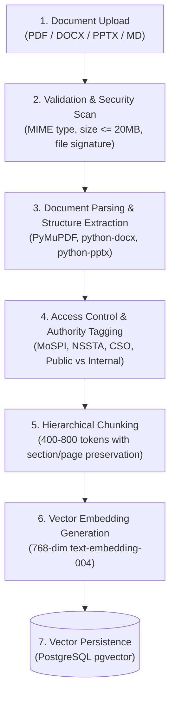
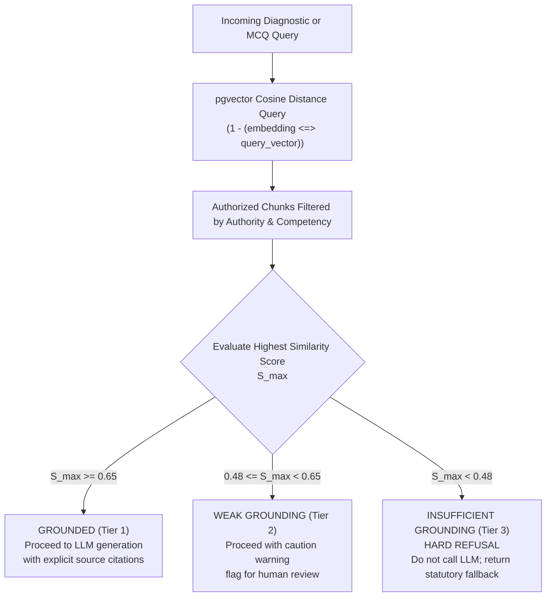
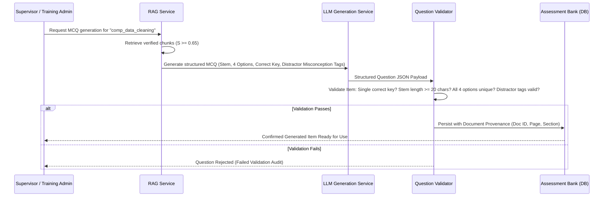

# STAT-GAP AI — Grounded RAG & Document Processing Architecture

## 1. Statutory Document Pipeline Overview

STAT-GAP AI processes official curriculum, procedural manuals, national standards, and instructional slide decks to power its grounded explanation and assessment generation engines.



---

## 2. Ingestion & Document Parsers

| Document Type | Parser Engine | Extraction Strategy | Metadata Captured |
|:---|:---|:---|:---|
| **PDF Documents** | `pypdf` / `PyMuPDF` | Clean text extraction, table layout preservation, heading hierarchy detection. | Page number, section header, document title, issuing division. |
| **Word Documents** | `python-docx` | Structured paragraph parsing, table cell extraction, style hierarchy (Heading 1, 2, 3). | Heading path, table index, author, revision date. |
| **PowerPoint Decks** | `python-pptx` | Slide-by-slide text box extraction, speaker notes extraction, bullet hierarchy. | Slide number, slide title, presentation theme. |
| **Markdown / Text** | Python native | Header splitting (`#`, `##`, `###`), list item preservation. | Section path, anchor slug. |

### Chunking Strategy
- **Target Size**: $500$ tokens ($\approx 2,000$ characters) with an overlap of $100$ tokens.
- **Context Injection**: Every chunk is prefixed with its document provenance:
  ```text
  [DOCUMENT: NSSTA Regression and Inference Guide | SECTION: 4.2 Residual Diagnostics | AUTHORITY: NSSTA/MoSPI]
  ```
- **Vector Representation**: 768-dimensional floating point vector generated via Google `text-embedding-004` (with offline fallback mock for automated CI testing).

---

## 3. Retrieval & The 3-Tier Grounding Gate

The system enforces a **strict mathematical grounding gate** prior to invoking generative LLMs. Generative models are **never permitted to answer freely from pre-trained parametric memory** for official statistical guidance.



### Grounding Thresholds Defined

| Grounding State | Similarity Range ($S_{\max}$) | System Behavior & Anti-Hallucination Defense |
|:---:|:---:|:---|
| **`grounded`** | $\mathbf{S_{\max} \ge 0.65}$ | Sufficient official evidence retrieved. The LLM synthesizes an explanation or MCQ strictly bounded to the supplied text. Source citations are appended to the response. |
| **`weak_grounding`** | $\mathbf{0.48 \le S_{\max} < 0.65}$ | Borderline relevance. System provides the response but flags it prominently with a warning indicator: *"Advisory response based on partial curriculum similarity."* |
| **`insufficient_grounding`** | $\mathbf{S_{\max} < 0.48}$ | **Hard Refusal**. The LLM generation is completely bypassed. The system returns an explicit refusal message to prevent any hallucination of government procedures or statistical formulas. |

---

## 4. Grounded MCQ Generation Pipeline

When generating new diagnostic items or practice questions from authorized manuals:



### Strict Traceability Contract
Every generated MCQ record in the database must persist:
1. `document_id`: Foreign key to `knowledge_documents`.
2. `chunk_id`: Foreign key to the specific `knowledge_chunks` row.
3. `page_number`: Exact page in the source PDF.
4. `source_citation`: Human-readable citation (e.g., *"MoSPI Sampling Manual, Vol II, p. 84"*).
5. `distractor_misconception_map`: JSON mapping which distractor corresponds to which fallacy from the Misconception Library.
