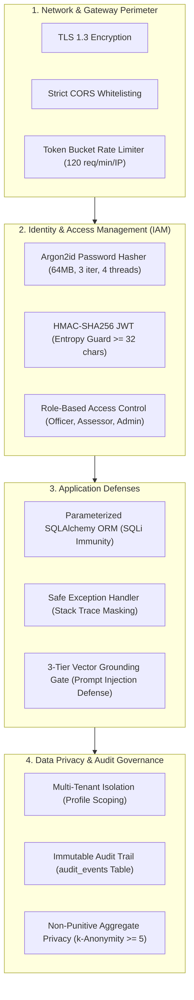

# STAT-GAP AI — Security Architecture & Governance Baseline

## 1. Statutory Civil Service Security Baseline

STAT-GAP AI is designed for deployment across Indian statistical bodies (such as the Ministry of Statistics and Programme Implementation — MoSPI) and administrative training institutes. As a competency intelligence platform processing official personnel capabilities and evaluation records, strict security boundaries are enforced across all tiers.



---

## 2. Authentication & Credential Hygiene

### 2.1 Password Security
- **Algorithm**: Argon2id (`argon2-cffi`) configured to civil service baseline:
  - Memory cost: $65,536\text{ KiB}$ ($64\text{ MiB}$)
  - Time cost: $3\text{ iterations}$
  - Parallelism: $4\text{ threads}$
- Passwords verified in constant time. Plaintext or intermediate hashes are never logged or stored.

### 2.2 JWT Access Tokens
- **Algorithm**: HMAC-SHA256 (`HS256`).
- **Enforcement**:
  - `JWT_SECRET_KEY` must be explicitly loaded from the environment.
  - Startup guards reject empty keys, keys shorter than 32 characters, and default development placeholders (`"change-me"`, `"secret"`, `"admin"`).
  - Signed tokens embed officer ID (`igot_id`), roles, issued-at (`iat`), and expiration (`exp`, default 24 hours).
- **Header Format**: `Authorization: Bearer <token>`.

### 2.3 Role-Based Access Control (RBAC) Matrix

| System Role | Scope of Access | Permissions & Operations |
|:---|:---|:---|
| **`OFFICER`** | Self-Service | Query own Digital Twin, attempt adaptive assessments, view own gap diagnoses, access micro-learning, trigger own refreshers. |
| **`ASSESSOR`** | Evaluation | All officer privileges plus: evaluate practical field exams, submit rubric scores, endorse verification status. |
| **`TRAINING_ADMIN`** | Institutional | Ingest curriculum documents (PDF/DOCX), manage competency catalogs, view cadre-wide aggregate heatmaps. |
| **`SUPER_ADMIN`** | Platform Governance | System configuration, adapter credentials, user management, audit log inspection. |

---

## 3. Data Protection & Non-Punitive Privacy

### 3.1 Multi-Tenant Data Isolation
- An officer can only query and mutate their own competency evidence, test sessions, retention metrics, and audit history:
  $$\text{current\_user.profile.id} == \text{resource.officer\_id}$$
- Cross-officer unauthorized requests return **HTTP 404** (not 403) to prevent resource existence enumeration.

### 3.2 Non-Punitive Aggregate Analytics
- Supervisory and administrative dashboards must never be used as a punitive surveillance tool.
- Workforce analytics are presented strictly as **cadre-level aggregate competency heatmaps**.
- In field offices with fewer than $5$ statistical officers, individual scores are masked using **$k$-anonymity ($k \ge 5$)** to prevent identifying specific individuals.

### 3.3 Data Minimization & Retention Controls
- The platform captures only data necessary for competency evaluation: statutory designation, cadre, department, experience, and performance signals.
- Personal biometric or non-professional sensitive data is strictly prohibited from schema storage.

---

## 4. Application Defenses & Threat Modeling

### 4.1 SQL Injection Prevention
- All database queries are executed strictly via SQLAlchemy 2.0 ORM expressions.
- Raw SQL string concatenation is forbidden.

### 4.2 Cross-Site Scripting (XSS)
- React 19 JSX context-aware encoding automatically neutralizes rendered strings.
- Dangerous DOM manipulation (`dangerouslySetInnerHTML`) is banned.

### 4.3 Prompt Injection & Hallucination Mitigation (RAG / LLM Layer)
- **Hard Grounding Gate**: All statistical explanations require cosine similarity $\ge 0.65$ against verified curriculum chunks.
- **Strict Anti-Hallucination Framing**: System prompts explicitly instruct the model never to extrapolate beyond retrieved context or fabricate statistical guidance.
- System prompt and user inputs are strictly delineated in JSON-structured payloads.

### 4.4 Rate Limiting & Denial of Service (DoS) Defense
- **Architecture**: In-memory token bucket rate limiter (`RateLimitMiddleware`).
- **Default Baseline**: $120\text{ req/min/IP}$.
- **Behavior**: Deterministic burst rejection returning HTTP 429 Too Many Requests with descriptive headers (`Retry-After: 60`).
- **Testing Safety**: Disabled in automated test mode (`RATE_LIMIT_ENABLED=false`).

### 4.5 Global Error Masking & Traceability
- **Unhandled Exceptions**: Caught by `safe_exception_handler`. Unhandled 500 exceptions are masked with standard JSON payloads, hiding stack traces from potential attackers:
  ```json
  {
    "detail": "An internal server error occurred. Please contact system administrator.",
    "code": "INTERNAL_SERVER_ERROR",
    "correlation_id": "9b1deb4d-3b7d-4bad-9bdd-2b0d7b3dcb6d"
  }
  ```
- **Audit Trail**: Every critical action writes an immutable record to `audit_events`.
