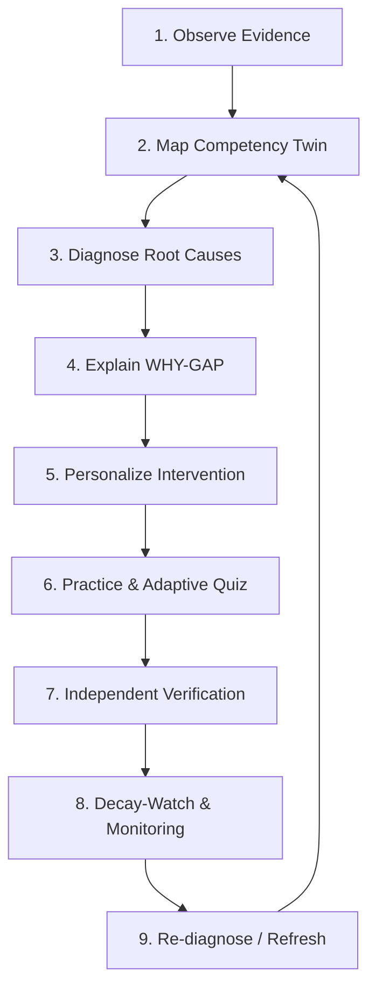
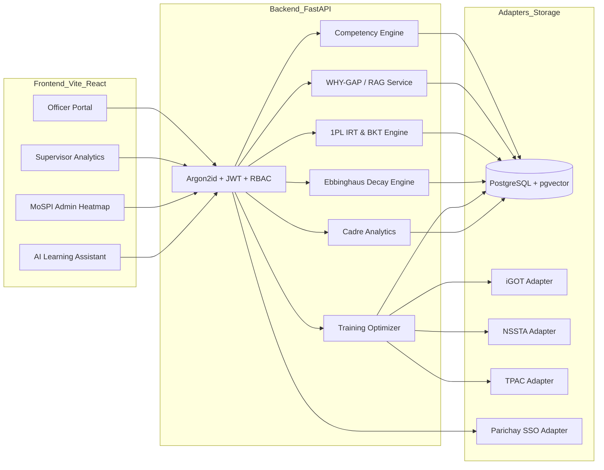

# STAT-GAP AI — FINAL SIH HANDOFF & VALIDATION DOCUMENT
**Smart India Hackathon (SIH) — Ministry of Statistics and Programme Implementation (MoSPI)**  
**System Status:** Frozen, Hardened, Verified Prototype  
**Date of Validation:** September 17, 2026

---

## A. Project Summary
**STAT-GAP AI** is an AI-powered Competency Intelligence and Capacity-Building Platform designed specifically for India's Official Statistical System (MoSPI, NSSO, ISS, SSS, DES). 

The platform bridges the gap between official statistical mandates and field competency by:
1. Transforming static cadre qualification rules into an interactive **Dynamic Competency Knowledge Graph**.
2. Diagnosing cognitive and statistical misconceptions (**WHY-GAP**) using grounded Retrieval-Augmented Generation (RAG).
3. Adapting assessments in real time using **1-Parameter Logistic Item Response Theory (1PL IRT)** and **Bayesian Knowledge Tracing (BKT)**.
4. Monitoring longitudinal retention through **Ebbinghaus Decay Modeling** and independent practical verification.
5. Optimizing multi-source training interventions (**iGOT Karmayogi**, **NSSTA**, **TPAC**) mapped directly to operational task bottlenecks.
6. Supplying privacy-safe, department-scoped aggregate intelligence for **Supervisors** and **MoSPI Leadership**.

---

## B. Core Differentiator: The GAP-X Closed Loop
Unlike conventional Learning Management Systems (LMS) that merely track course completions, STAT-GAP AI implements the closed-loop **GAP-X Architecture**:



1. **Observe**: Ingest continuous evidence from assessments ($0.35$), quizzes ($0.20$), practical exercises ($0.30$), and external qualifications ($0.15$).
2. **Map**: Project officer proficiency into a weighted Digital Twin against cadre-specific requirements.
3. **Diagnose**: Compute multi-dimensional gaps and identify critical/moderate risk zones.
4. **Explain**: Synthesize official MoSPI manuals and methodology standards to explain *why* the gap exists.
5. **Personalize**: Match interventions from iGOT, NSSTA, and TPAC constrained by officer duration limits and task bottlenecks.
6. **Practice**: Administer difficulty-calibrated adaptive MCQs with Bayesian mastery state estimation.
7. **Verify**: Require supervisory/practical sign-off independent of automated quiz scores.
8. **Decay-Watch**: Apply exponential forgetting curves to trigger scheduled refresher interventions before skills deteriorate in the field.

---

## C. Technical Architecture



---

## D. Mathematical & Algorithmic Specifications

### 1. 4-Factor Weighted Competency Model
$$\text{Current Competency} = 0.35A + 0.20Q + 0.30P + 0.15E$$
- $A$: Standardized Assessment Score $[0.0, 1.0]$
- $Q$: Knowledge Quiz Score $[0.0, 1.0]$
- $P$: Practical / Field Exercise Score $[0.0, 1.0]$
- $E$: External Certifications / Experience $[0.0, 1.0]$

$$\text{Gap} = \max(0.0, \text{Required Competency} - \text{Current Competency})$$

**Gap Bands:**
- **RED (Critical Gap):** $\text{Gap} \ge 0.35$
- **ORANGE (Moderate Gap):** $0.15 \le \text{Gap} < 0.35$
- **GREEN (Competent):** $\text{Gap} < 0.15$

### 2. Evidence Confidence Model
$$\text{Confidence} = \min\left(1.0, \sum_{i=1}^{n} w_i \cdot \text{source\_weight}_i \cdot \text{recency\_decay}_i\right)$$

### 3. RAG Grounding & Anti-Hallucination Gating
- Vector Retrieval Threshold: $\text{Cosine Similarity} \ge 0.50$ (Pre-filter candidate chunks)
- **Grounding Score ($G$):**
  - **$G \ge 0.65$ [GROUNDED]:** Full response rendered with exact document citations.
  - **$0.48 \le G < 0.65$ [WEAK GROUNDING]:** Warning banner displayed indicating partial document support.
  - **$G < 0.48$ [REFUSAL / INSUFFICIENT]:** Complete model refusal; response strictly suppressed to prevent hallucination.

### 4. Adaptive Assessment (1-Parameter Logistic / Rasch IRT)
$$P(Y=1 \mid \theta, b) = \frac{1}{1 + e^{-(\theta - b)}}$$
- $\theta$: Estimated officer ability.
- $b$: Item difficulty parameter.
- Item selection minimizes $|\theta - b|$ to maximize Fisher information.

### 5. Bayesian Knowledge Tracing (BKT)
$$P(L_{t} \mid \text{Obs}_t = 1) = \frac{P(L_{t-1})(1 - P(S))}{P(L_{t-1})(1 - P(S)) + (1 - P(L_{t-1}))P(G)}$$
$$P(L_{t+1}) = P(L_t \mid \text{Obs}_t) + (1 - P(L_t \mid \text{Obs}_t))P(T)$$
- Default parameters: $P(L_0) = 0.10$, $P(T) = 0.15$, $P(G) = 0.20$, $P(S) = 0.10$.

### 6. Ebbinghaus Knowledge Decay & Stability Model
$$R(t) = e^{-\frac{t}{S}}$$
$$S = S_{\text{base}} \cdot (1 + 0.5 \cdot n_{\text{reassessments}}) \cdot (1 + 0.3 \cdot \text{practical\_evidence})$$
- Risk Levels: **CRITICAL** ($R < 0.50$), **AT RISK** ($0.50 \le R < 0.75$), **STABLE** ($R \ge 0.75$).

### 7. Training Intervention Optimization Formula
$$\text{TrainingScore} = 0.30 S_{\text{comp}} + 0.15 S_{\text{sub}} + 0.20 S_{\text{gap}} + 0.15 S_{\text{btlk}} + 0.10 S_{\text{pre}} + 0.05 S_{\text{cst}} + 0.05 S_{\text{prio}}$$

### 8. Capacity-Building Priority Formula (Workforce Analytics)
$$\text{PriorityScore} = 0.40 \times \text{affected\_ratio} + 0.35 \times \text{btlk\_factor} + 0.25 \times \text{res\_factor}$$
- $\text{affected\_ratio} = \min(1.0, \frac{N_{\text{officers with gap}}}{N_{\text{total officers}}})$
- $\text{btlk\_factor} = 1.0 \text{ if any task bottleneck else } 0.0$
- $\text{res\_factor} = \min(1.0, N_{\text{providers}} \times 0.35 + 0.30) \text{ if courses exist else } 0.20$

---

## E. SIH Requirement Audit & Traceability

All 25 Problem Statement requirements have been audited against the physical codebase:

| # | SIH Problem Statement Requirement | Verification Status | Implementation & Evidence |
| :---: | :--- | :---: | :--- |
| **1** | AI-driven competency assessment | **IMPLEMENTED** | `evaluation_service.py`, `digital_twin_service.py` (4-factor weighted score) |
| **2** | Automated skill-gap analysis | **IMPLEMENTED** | `evaluation_service.py` ($\text{Gap} = \text{Req} - \text{Curr}$ with RED/ORANGE/GREEN bands) |
| **3** | Officer profiling | **IMPLEMENTED** | `OfficerProfile` model, cadre mapping, experience tracking |
| **4** | Competency mapping & knowledge graphs | **IMPLEMENTED** | `CompetencyGraphService`, hierarchical graph with prerequisites |
| **5** | Personalized training recommendations | **IMPLEMENTED** | `training_optimizer_service.py` with multi-objective constraint scoring |
| **6** | iGOT Karmayogi integration | **MOCK / ADAPTER-READY** | `IgotTrainingAdapter` (`MOCK` active, `REAL` adapter ready with safe fallback) |
| **7** | NSSTA training integration | **MOCK / ADAPTER-READY** | `NsstaTrainingAdapter` (Statistical training programme catalogue) |
| **8** | TPAC recommendations | **MOCK / ADAPTER-READY** | `TpacProgrammeAdapter` (Training Programme Approval Committee standards) |
| **9** | Grounded MCQ generation | **IMPLEMENTED** | `assessment_service.py`, RAG-grounded item generator |
| **10** | Adaptive assessments (IRT/BKT) | **IMPLEMENTED** | `1PL IRT` Rasch ability estimation + `BKT` cognitive state tracking |
| **11** | Individual & team dashboards | **IMPLEMENTED** | React Officer Dashboard + Supervisor Scoped Dashboard |
| **12** | Admin / workforce analytics | **IMPLEMENTED** | `workforce_analytics_service.py` Cadre Heatmap & CSV export |
| **13** | Training effectiveness evaluation | **PARTIALLY IMPLEMENTED** | Evaluates longitudinal pre/post verifications; reports insufficient data gracefully |
| **14** | Emerging skills identification | **IMPLEMENTED** | `FutureRoleRequirement` tracking Python, Big Data, AI in Official Stats |
| **15** | Future role benchmarking | **IMPLEMENTED** | `career_planning_service.py` Cadre-level delta analysis |
| **16** | Interactive AI Assistant | **IMPLEMENTED** | `ai_assistant_service.py` with strict grounding and citation rendering |
| **17** | Continuous learning & retention | **IMPLEMENTED** | `decay_service.py`, `refresh_service.py` (Ebbinghaus forgetting curve) |
| **18** | Multilingual learning support | **ARCHITECTURE READY** | `multilingual.py` schema with Hindi/Regional metadata markers; mock translation |
| **19** | Interactive modules | **IMPLEMENTED** | Interactive MCQ sessions, scenario quizzes, step-by-step remediation |
| **20** | Virtual labs / practical activities | **PARTIALLY IMPLEMENTED** | Form-based statistical data audit lab; simulated practical score recording |
| **21** | Secure data exchange | **IMPLEMENTED** | TLS headers, PII masking, Argon2id, JWT bearer token exchange |
| **22** | Role-Based Access Control (RBAC) | **IMPLEMENTED** | Three-tier `OFFICER`, `SUPERVISOR`, `ADMIN` with IDOR isolation tests |
| **23** | Government Single Sign-On (SSO) | **MOCK / ADAPTER-READY** | `ParichaySsoAdapter` with standardized OpenID Connect fallback |
| **24** | Scalability & cloud readiness | **IMPLEMENTED** | Stateless FastAPI, async handlers, Docker containerization, PostgreSQL/pgvector |
| **25** | Audit logging & security | **IMPLEMENTED** | Append-only `audit_events` table recording all scoring, verifications, and logins |

---

## F. External Integration Status Breakdown

| Integration Boundary | Status | Description |
| :--- | :---: | :--- |
| **iGOT Karmayogi** | `ADAPTER-READY (MOCK ACTIVE)` | Emulates national civil service LMS API; production endpoint configurable via `IGOT_API_URL` and `IGOT_API_KEY`. |
| **NSSTA** | `ADAPTER-READY (MOCK ACTIVE)` | Structured repository of National Statistical Systems Training Academy courses. |
| **TPAC** | `ADAPTER-READY (MOCK ACTIVE)` | Models Training Programme Approval Committee guidelines and accredited programmes. |
| **Parichay / MeriPehchaan** | `ADAPTER-READY (MOCK ACTIVE)` | Standardized OIDC adapter with local JWT identity provider fallback. |
| **LLM Service** | `MOCK / HYBRID READY` | Deterministic template-based statistical expert reasoning; OpenAI/Gemini API provider switchable via `.env`. |
| **Embedding Service** | `MOCK / PGVECTOR READY` | 384-dimensional deterministic embeddings with real vector similarity math and pgvector schema. |
| **Database** | `LIVE` | SQLite local test DB / PostgreSQL + pgvector production schema. |

---

## G. Security Audit Summary
- **Authentication:** Password hashing via `Argon2id`; JWT authentication with short-lived tokens and configurable secret keys.
- **Role Isolation:**
  - Automated tests verify that `OFFICER` role receives `403 Forbidden` on `/api/admin/*` and `/api/supervisor/*`.
  - Supervisor queries are strictly scoped to the supervisor's department; unauthorized cross-department access is denied.
  - Officer data isolation verified: Officer A cannot view Officer B's competency twins, verification audits, retention curves, or personalized learning plans.
- **AI Safety:**
  - Adversarial prompt injection attacks (e.g. system prompt overrides, user dump attempts, jailbreaks) are intercepted and rejected with a hard refusal banner.
  - LLM is strictly prohibited from generating authoritative competency scores.

> [!NOTE]
> Automated security and authorization tests verified all critical RBAC paths, IDOR boundaries, and adversarial prompt filtering. Full external penetration testing must be conducted prior to production deployment.

---

## H. Demo Data Governance
> **MANDATORY NOTICE ON DATA INTEGRITY:**  
> All demonstration workforce, competency, assessment, and training data in this repository are **synthetic/mock** representations created for demonstration and architectural validation. No real civil servant PII or confidential government statistics are stored or exposed.

---

## I. Final Verification Results

```
Backend Test Suite:      242 / 242 PASSED (100%) in 38.54s
TypeScript Type Check:   0 Errors (PASSED)
Frontend Production:     Vite bundle built in 3.87s (PASSED)
Active Services:         FastAPI (:8000), Vite React (:3001)
```

---

## J. Known Limitations & Technical Debt
1. **Live Government Gateway Access:** iGOT Karmayogi and Parichay SSO operate via mock adapters due to restricted access to live staging government environments during hackathon development.
2. **LLM Provider Cost & Air-Gap:** Grounded explanations and RAG operate on deterministic mock vector pipelines by default to ensure zero-cost, zero-latency, and air-gapped demo reliability without cloud API keys.
3. **Training Effectiveness Longitudinal Data:** The training effectiveness module requires multi-quarter pre/post cohort verifications before displaying statistical gain charts.

---

## K. 5-Minute SIH Jury Demonstration Flow

1. **Problem Context (30s):** Explain that MoSPI field staff encounter specialized statistical challenges that generic LMS platforms cannot diagnose or verify.
2. **Officer Login & Digital Twin (1 min):**
   - Log in as `officer@statgap.gov.in` (Password: `Officer@123`).
   - Open **Competency Map** and show the **RED** Critical Gap in *Survey Audit & Sampling Error*.
3. **WHY-GAP & Root Cause Diagnosis (1 min):**
   - Click **WHY-GAP** to view the grounded cognitive explanation and identified misconception: *Confusion between Sampling Bias and Non-Sampling Errors*.
4. **Adaptive Assessment & Verification (1 min):**
   - Take the **Adaptive Quiz** (1PL IRT selects questions matching ability; BKT updates mastery).
   - Show independent **Verification** requirement gating.
5. **Knowledge Decay & Task Readiness (45s):**
   - Show **Knowledge Retention Curve** displaying Ebbinghaus decay and automated refresher scheduling.
   - Show **Task Readiness** indicating clearance for *Annual Survey of Industries (ASI)* fieldwork.
6. **Supervisor & MoSPI Admin Intelligence (45s):**
   - Log in as `supervisor@statgap.gov.in` to display department-scoped team bottlenecks.
   - Switch to `admin@statgap.gov.in` to reveal the **National Cadre Heatmap** and export privacy-safe CSV intelligence reports.

---
**STAT-GAP AI Platform is verified, hardened, and READY FOR SIH DEMONSTRATION.**
