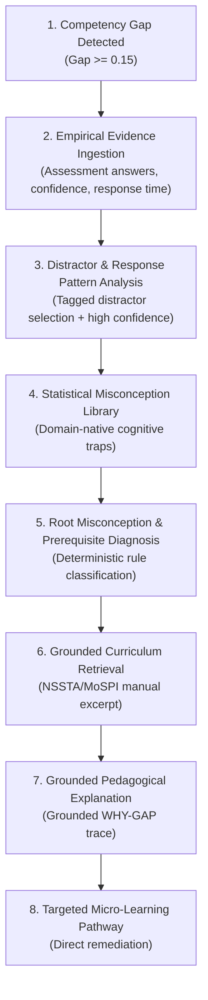
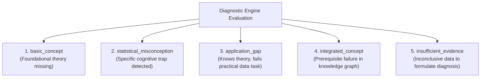

# STAT-GAP AI — WHY-GAP & Statistical Misconception Intelligence

## 1. The Core Differentiator: Moving from "What" to "Why"

Standard evaluation platforms provide only descriptive scores (e.g., *"Officer scored 48% in Regression Diagnostics"*). This gives the officer and supervisor no actionable insight into the root cause of the deficiency.

**WHY-GAP** is the core cognitive intelligence engine of STAT-GAP AI. It answers:
> **"What specific cognitive distortion, procedural misunderstanding, or ontological prerequisite gap caused this officer's performance deficit?"**



---

## 2. Epistemic Principles & Anti-Hallucination Framing

1. **No Claims of Absolute Truth**: The platform must **NEVER** claim that an AI or LLM has *"scientifically proven an officer's mental state"*. Diagnoses are explicitly presented as **evidence-based, rule-supported hypotheses with confidence ratings and supporting citations**.
2. **Deterministic Trigger, Generative Articulation**:
   - The diagnosis classification is determined by deterministic rules (e.g., selection of specific distractors coupled with confidence ratings).
   - The LLM's role is restricted to translating the diagnosed pattern and retrieved curriculum excerpts into a clear, supportive, and pedagogical narrative.

---

## 3. The Statistical Misconception Library

STAT-GAP AI maintains a curated catalog of statistical misconceptions specifically relevant to India's official statistical system:

| Misconception ID | Concept Title | Description of the Cognitive Trap | Empirical Detection Rule | Correct Statistical Principle |
|:---|:---|:---|:---|:---|
| `misc_r2_causality` | **Causality-from-Fit Fallacy** | Believing a high Coefficient of Determination ($R^2 > 0.85$) proves that the independent variable causally drives the dependent variable. | Selected Option B on Item `reg_01` (asserting causality) with Confidence $=$ "High". | $R^2$ measures shared variance and linear association, not causal directionality or absence of omitted confounders. |
| `misc_p_value_magnitude` | **p-Value Effect Size Fallacy** | Equating a very small p-value ($p < 0.001$) with a large, substantive policy impact in large sample surveys (PLFS). | Selected Option C on Item `inf_03` (confusing significance with magnitude). | In large sample sizes, trivial effect sizes achieve statistical significance; substantive importance requires confidence intervals and effect size metrics. |
| `misc_sample_size_bias` | **Big Data Overcomes Bias Fallacy** | Believing that a massive sample size ($N = 100,000$) eliminates systematic sampling frame coverage bias. | Selected Option A on Item `samp_02` (asserting sample size fixes non-random sampling). | Sample size reduces sampling variance but leaves systematic non-sampling bias completely uncorrected. |
| `misc_outlier_deletion` | **Heuristic Outlier Trimming Fallacy** | Automatically deleting extreme values in household consumption data without verifying enumerator notes or economic validity. | Flagged in practical data cleaning module where valid top 1% agricultural holdings were removed. | Legitimate skewed distributions (e.g., wealth, land holdings) must be treated via robust estimators or verified against field re-interviews, not deleted. |
| `misc_simpsons_paradox` | **Aggregation Confounding Fallacy** | Drawing national-level conclusions that reverse at the state or district level due to unstratified demographic weighting. | Misinterpreted trend reversals during regional survey aggregation exercises. | Aggregated relationships can reverse when lurking variables or stratum weights are not controlled (Simpson's Paradox). |

---

## 4. Diagnostic Taxonomy

The engine classifies every identified gap into one of five structured diagnostic categories:



1. **`basic_concept`**: Officer demonstrates weak performance across both conceptual quizzes and formal assessments. Remediation: Re-learn core definitions and mathematical proofs.
2. **`statistical_misconception`**: Officer demonstrates strong confidence but selects systematic distractor patterns linked to a registered misconception. Remediation: Cognitive disequilibrium via targeted counter-examples.
3. **`application_gap`**: Officer scores well in theoretical MCQs ($\ge 80\%$) but performs poorly on practical survey datasets ($< 50\%$). Remediation: Hands-on computational exercises and real-world micro-tasks.
4. **`integrated_concept`**: Gap in an advanced competency (e.g., National Accounts) is traced directly to an unfulfilled prerequisite (e.g., Price Indices). Remediation: Repair prerequisite node first.
5. **`insufficient_evidence`**: Fewer than the minimum required data points exist to formulate a reliable diagnosis. Remediation: Complete a baseline diagnostic quiz.

---

## 5. Grounded Explanation Generation Pipeline

```python
class GroundedWhyGapResponse(BaseModel):
    competency_id: str
    diagnosis_type: str
    severity: str
    confidence: float
    what_officer_believes: str       # Specific misconception identified
    correct_mathematical_truth: str  # Grounded from official MoSPI manual
    diagnostic_synthesis: str        # Synthesized reasoning trace
    remediation_action: str          # Suggested micro-learning module
    source_citations: List[str]      # Verified document citations
```

If the RAG retrieval fails to locate authoritative curriculum text backing the statistical rule, the system refuses to generate a speculative response and falls back to:
> *"INSUFFICIENT_GROUNDING: Official statistical documentation could not be retrieved with adequate similarity. An authoritative diagnostic explanation cannot be generated without verified source grounding."*
